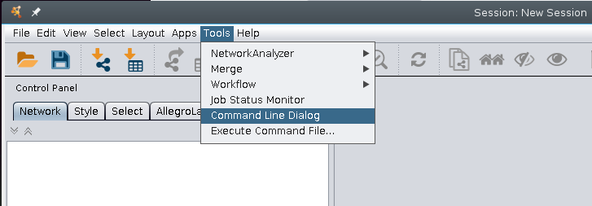
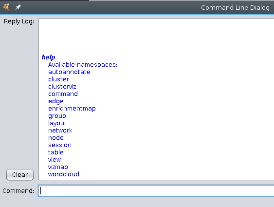
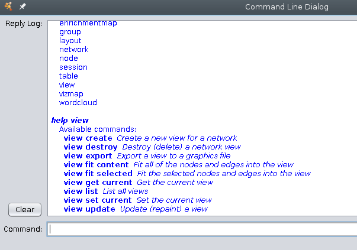
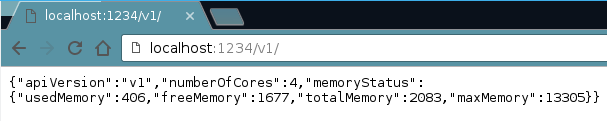
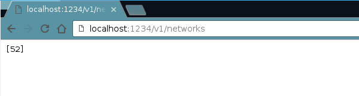
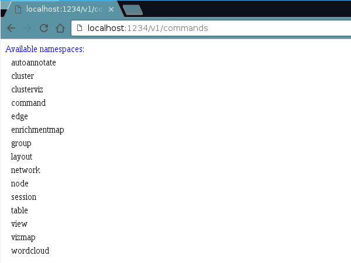
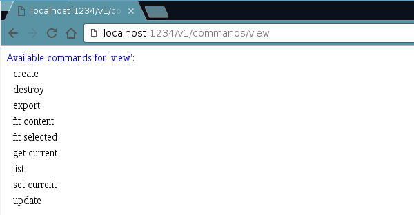

# Wrap up on gsoc project using RCy3 with Cytoscape

So this summer as part of my gsoc porject I tried to make some workflwos for biologista that made things more straightforward to run using the programming language R.

We were motivated to do this because many scientists are working iwth more and more data and thus can be confronted with the task of repeaating analyses (well that is always the case) or with performing similar analyses on multiple datasets. Cytoscape is great for doing many different analyses, however with its graphical user interface (i.e. click heavy) this can be problematic for repeating analyses. 

We thought that we would create demostrations (basically vignettes that could be incorporated into the RCy3 package) of some commonly used workflows in Cytoscape that we could script with RCy3. 

## My experience
Overall working with NRNB as part of Google summer of Code was a great experience. I interacted with many  different people and was well supported by my mentor. It was a new challenge to work remotely on  a project like this, but in the end I am happy with how it turned out. 

# The process:
To do this we are using CYREST which was developped by the Barry Demchek lab. More information about it is available here (paper), here is the Github repository and here is a useful website for learning about the commands that are available in the API. 

# Difficulties with CyREST

1) Saving images from Cytoscape via cyREST is really dependent on the size of the window that you have open. You can use a parameter "h" which sets the size of the final image, but the width is set automatically.
2) Plugins in Cytoscape that present an API interface do not have a standard verb-action vocabulary. I have to mention that developpers that make these plugins are not under any obligation to do this. This is not a huge deal, but requires some guessing of how plugins can be used via cyREST. It can be unclear why certain arguments are available in the app gui and these are not avaible via cyREST. 

# Working with cyREST

To do this we identified plugins that present their APIs to cyrest and thus are able to be used on the command line and by use from R.

Our main goal here was to create a reproducible analysis, but to find out what commands are available to use we needed to do a bit of investigation.

## Ways to examine commands available via API

### Via command line tool in Cytoscape

- Show how to check at the command line (this is related to difficulty # 2)


Type in `help` into the command line box and press Enter (or Return).



To look specifically at a specific command you can type `help` followed by the command (or plugin). If we type `help view` and press Enter (or Return) here we see:



### Via your favourite internet browser

This can also be examined in the browser. The default setting for the CyREST api has Cytoscape at localhost:1234. We will need to direct ourselves to the version 1 of cyREST as well. So if we do that, we get some details about Cytoscape and the API. 

(THIS IS BECAUSE CYREST BLAH BLAH BLAH)



If we want to see a listing of the networks we have we can type: 



If we want to examine the possible commands available (like what we did with the command line dialogue above) we can type:



If we want to see the commands available within a set of commands we can type: 



You could indeed run commands from here, but this is not very practical and would defeat our purpose. We will switch to RCy3 in R to run the commands that we want to execute, but this was just to show you a straightforward way to see which commands are available. 

### Using RCy3

In R, I have written code that allows me to also check on the commands available and the arguments available for these commands:

```r
library(RCy3)
source("./functions_to_add_to_RCy3/working_with_namespaces.R")
```

Test out the function to see what commands are available in Cytoscape

```r
cy <- CytoscapeConnection ()
getCommandNames(cy)
```

```
##  [1] "cluster"       "clusterviz"    "command"       "edge"         
##  [5] "enrichmentmap" "group"         "layout"        "network"      
##  [9] "node"          "session"       "table"         "view"         
## [13] "vizmap"
```

See what arguments are available within view

```r
getCommandsWithinNamespace(cy, "view")
```

```
## [1] "create"       "destroy"      "export"       "fit content" 
## [5] "fit selected" "get current"  "list"         "set current" 
## [9] "update"
```


# Other summer activities

I presented part of one of the workflows that I was working on at a scientific meeting this summer. The meeting was the Viruses of Microbes meeting in Liverpool, UK. Repository that contains the poster and code used to generate it are [here](https://github.com/jooolia/RCy3_VOM_poster). This was my first time creating and presenting a poster like this and it was quite enjoyable. 

# Posts to come:

Feel free to check out my final work submission here: 

We will be releasing blog posts hilighting the different workthroughs that were created.
Here is a list of topics that are forthcoming:

- Enrichment Maps using cytoscape plugin EMap
- Co-occurence network using microbial data
- Using paxtoolsr to get information from Pathway Commons and display in CYtoscape
- Using chemviz to examine the chemical properties and structures of data and creating a network based on chemical similarity

- vignettes as a separate package?