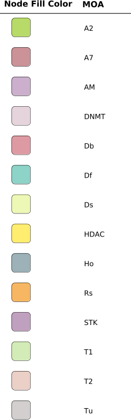

# Introduction

Scientists can have information about chemical compounds and then want a simple way to visualize the chemical structure and also the to understand the chemical similarity of compounds (Tanimoto similarity). This can be done in Cytoscape using the Chemviz plugin

In this vignette we will use the R package rcellminer to generate some data that we will use to look a some drug compounds. Then, in Cytoscape, we will then see how these drugs are chemically related, look at the 2-dimensional structures of these compounds and then colour the compounds by their mechanism of action to see if it is related to their similarity. 

# Required materials: 

- Cytoscape (www.cytoscape.org)
- Chemviz - plugin for Cytoscape (http://www.cgl.ucsf.edu/cytoscape/chemViz2/index.shtml)
- Rpackages: RCy3, httr, JSONIO, rcellminer, RColorBrewer

# Load the packages
```{r, message = FALSE}
library(RCy3)
library(rcellminer)
library(RColorBrewer)
source("./functions_to_add_to_RCy3/working_with_namespaces.R")
```


# Get data from rcellminer
```{r}

df <- getFeatureAnnot(rcellminerData::drugData)[["drug"]]
## smiles strings
## moa mechanism of action

moaToCompounds <- getMoaToCompounds()
Moa_names <- names(moaToCompounds)

df_knownMoaDrugs <- subset(df, MOA %in% Moa_names)

## use only those with greater than 3 experiments
df_with_knownMoaDrugs <- subset(df_knownMoaDrugs, TOTAL_EXPS > 10)
```

For display purposes we will chop off long names after 12 characters. 

```{r}

long_names <- df_with_knownMoaDrugs$NAME[nchar(df_with_knownMoaDrugs$NAME) > 12] 
chopped_long_names <- gsub("^(.{12})(.*)$", "\\1", long_names)
df_with_knownMoaDrugs$NAME[nchar(df_with_knownMoaDrugs$NAME) > 12 ] <- chopped_long_names
```


# Set up connection between R and Cytoscape 
```{r}
# first, delete existing windows to save memory:
deleteAllWindows(CytoscapeConnection())
cy <- CytoscapeConnection()
getCommandsWithinNamespace(cy,
                           "chemviz")
```


# Format dataframe from RCellMiner to format that can be sent to cytoscape
```{r}
g <- new("graphNEL",
         nodes = df_with_knownMoaDrugs$NAME,
         edgemode = "undirected")

cw <- CytoscapeWindow("vignette_for_chemviz",
                      graph = g,
                      overwrite = TRUE)
```

```{r, message = FALSE}
displayGraph(cw)
layoutNetwork(cw,
              layout.name = "grid")
showGraphicsDetails(cw, new.value)
```

```{r}
g <- cw@graph   
g <- initNodeAttribute(graph = g,
                       "SMILES",
                       "char",
                       "none")
nodeData(g, nodes(g), "SMILES") <- df_with_knownMoaDrugs$SMILES

g <- initNodeAttribute(graph = g,
                       "NSC_from_df",
                       "char",
                       "none")
nodeData(g, nodes(g), "NSC_from_df") <- df_with_knownMoaDrugs$NSC

g <- initNodeAttribute(graph = g,
                       "MOA",
                       "char",
                       "none")
nodeData(g, nodes(g), "MOA") <- df_with_knownMoaDrugs$MOA
```

```{r, message = FALSE}
cw <- setGraph(cw,
               g)
displayGraph(cw) # cw's graph is sent to Cytoscape
```


Network successfully sent to Cytoscape. The node attributes have also been sent. 
```{r, echo=FALSE}
fitContent(cw)
Sys.sleep(10)
saveImage(cw,
          "nodes_for_chemviz",
          "png", h = 2000)
knitr::include_graphics("./nodes_for_chemviz.png")
```

# Create similarity network

Next based on the chemical properties of each node (which are associated using the SMILES strings (Simplified Molecular Input Line Entry System which are line representations of chemical structures) we will use chemviz to calculate the similarity of each drug based on its chemical properties (using Tanimoto similarity which is a distance-based measure of chemical similarity). 

To begin let's look at some of the commands available to use in chemviz:
```{r}
getCommandsWithinNamespace(cw, "chemviz")
```

Now let's look at the arguments we can use for creating a similarity network:
```{r}
getCommandsWithinNamespace(cw, "chemviz/create%20similarity")
```

Set the properties that we would like to use
```{r}
properties.list <- list(createNewNetwork = TRUE,
                        network = "current",
                        nodeList = "all")

command.name <- "chemviz/create%20similarity"

chemviz_cw <- setCommandProperties(cw,
                     command.name,
                     properties.list,
                     copy.graph.to.R = FALSE)
```

```{r, echo=FALSE}
fitContent(chemviz_cw)
Sys.sleep(10)
saveImage(chemviz_cw,
          "chemviz_similarity_net",
          "png",
          h =2000)
knitr::include_graphics("./chemviz_similarity_net.png")
```

We currently just have the network in the grid format, but now with edges connecting the nodes we can do a layout that can help us visualize the connections.

Since we made a new network that is in Cytoscape, but not yet connected to our R session we will first need to connect to this window and then we can apply a layout. 
```{r}
connectToNewestCyWindow <- function(obj,
                                    copyToR = FALSE) {
  resource.uri <- paste(obj@uri,
                        pluginVersion(obj),
                        "networks",
                        sep = "/")
  request.res <- GET(resource.uri)
  # SUIDs list of the existing Cytoscape networks
  cy.networks.SUIDs <- fromJSON(rawToChar(request.res$content))
  # most recently made enrichment map will have the highest SUID
  cy.networks.SUIDs.last <- max(cy.networks.SUIDs)
  
  res.uri.last <- paste(obj@uri,
                        pluginVersion(obj),
                        "networks",
                        as.character(cy.networks.SUIDs.last),
                        sep = "/")
  result <- GET(res.uri.last)
  net.name <- fromJSON(rawToChar(result$content))$data$name
  
  ## to get edges request.res$elements$edges
  newest_CyWindow <- existing.CytoscapeWindow(net.name,
                                     copy.graph.from.cytoscape.to.R = copyToR) 
  return(newest_CyWindow)
}

new_cw <- connectToNewestCyWindow(chemviz_cw)
```


```{r}
layoutNetwork(new_cw, "force-directed")
```


```{r, echo=FALSE}
fitContent(new_cw)
Sys.sleep(10)
saveImage(new_cw,
          "chemviz_similarity_net_layout_fd",
          "png",
          h=2000)
knitr::include_graphics("./chemviz_similarity_net_layout_fd.png")
```

# Add 2D chemical structures to nodes

Another thing we can do with chemviz is to add the two dimensional chemical structure on to the nodes of our networks. 

Let's look again at the commands available in Chemviz:
```{r}
getCommandsWithinNamespace(new_cw, "chemviz")
```

And the arguments needed for the command we want to use: "paint structures"
```{r}
getCommandsWithinNamespace(new_cw, "chemviz/paint%20structures")
```

```{r, results="hide", message = FALSE}
properties.list <- list(nodeList = "all")

command.name <- "chemviz/paint%20structures"

setCommandProperties(new_cw,
                     command.name,
                     properties.list,
                     copy.graph.to.R = FALSE)
```

Now we have all of the chemical structures displayed on the nodes of our network. 

```{r, echo=FALSE}
fitContent(new_cw)
Sys.sleep(10)
saveImage(new_cw,
          "chemviz_similarity_net_node_structures",
          "png", h = 2000)
knitr::include_graphics("./chemviz_similarity_net_node_structures.png")
```


# Colour nodes by mechanism of action (MOA)

The nodes that we are examining have mechanisms of action (MOA) associated with them. We can then colour these nodes by their MOA. 

```{r}
MOA_classes <- unique(df_with_knownMoaDrugs$MOA)
number_of_unique_MOA <- length(MOA_classes)
colours_for_MOA_classes <- colorRampPalette(brewer.pal(12, "Set3"))(number_of_unique_MOA)
```


We have `r number_of_unique_MOA` different MOA classes and have used RColorBrewer to generate different colours for the different classes. 

```{r}
setNodeColorRule(new_cw,
                 "MOA",
                 MOA_classes,
                 colours_for_MOA_classes,
                 "lookup", 
                 default.color = "#000000")

## node font looks ugly, let's turn it off for now
setDefaultNodeFontSize(new_cw,
                       0)
```

We have coloured the nodes nicely, but we do not know which ones are associated with which classes. To know more about this we will print out the legend from Cytoscape. At the moment there is no automated way to do this so we need to go into Cytoscape, click on the "Style" tab and then click on the little arrow (that has a mouseover text of "Options"). Once the menu opens there you will find a dialogue that lets you export a legend (in gif, svg, or pdf formats). Once exported we will look at the legend beside our new coloured network. 

```{r, echo=FALSE}
fitContent(new_cw)
Sys.sleep(10)
saveImage(new_cw,
          "chemviz_similarity_net_coloured_by_MOA",
          "png",
          h = 2000)
```

  