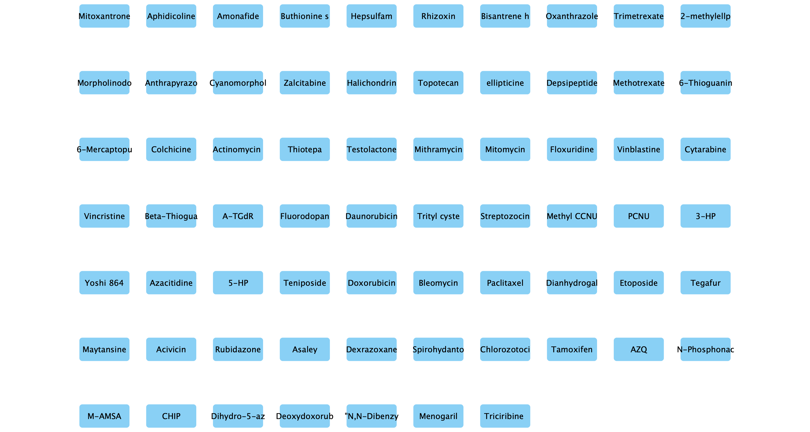
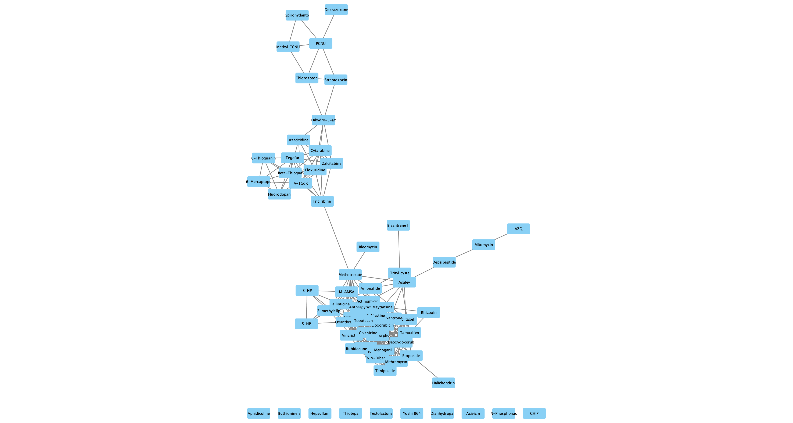
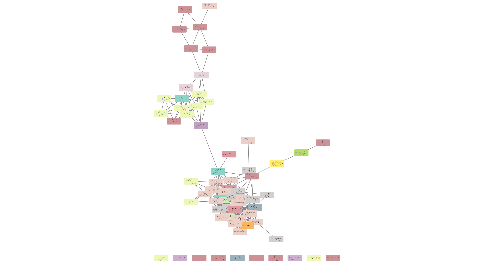

```{r, message = FALSE}
library(RCy3)
library(httr)
library(RJSONIO)
source("./functions_to_add_to_RCy3/working_with_namespaces.R")
```

# Trying out chemviz with R 
```{r}
cy <- CytoscapeConnection ()
getCommandsWithinNamespace(cy, "chemviz")
```


# Get data from rcellminer
```{r}
library(rcellminer)
df <- getFeatureAnnot(rcellminerData::drugData)[["drug"]]
## smiles strings
## moa mechanism of action

## could take drugs with stuff in the MOA colum
x <- df[sample(nrow(df), 100), c("NSC", "NAME", "FDA_STATUS", "SMILES", "MOA")]

moaToCompounds <- getMoaToCompounds()
Moa_names <- names(moaToCompounds)

df_knownMoaDrugs <- subset(df, MOA %in% Moa_names)

## use only those with greater than 3 experiments
df_with_knownMoaDrugs <- subset(df_knownMoaDrugs, TOTAL_EXPS > 10)
```

ok gonna try just to export and do this in cytoscape right now

```{r}
write.csv(df_with_knownMoaDrugs, "./df_with_knownMoaDrugs.csv",
          quote = FALSE)
```

works. 

```{r}
g <- new('graphNEL', nodes=df_with_knownMoaDrugs$NSC,edgemode='undirected')

cw <- CytoscapeWindow('vignette_for_chemviz', graph=g, overwrite=TRUE)
displayGraph(cw)
layoutNetwork(cw, layout.name='grid')


g <- cw@graph   
g <- initNodeAttribute(graph = g,
                          'SMILES',
                          'char',
                          "none")
nodeData(g, nodes(g), 'SMILES') <- df_with_knownMoaDrugs$SMILES
g <- initNodeAttribute(graph = g,
                          'NAME_from_df',
                          'char',
                          "none")
nodeData(g, nodes(g), 'NAME_from_df') <- df_with_knownMoaDrugs$NAME

g <- initNodeAttribute(graph = g,
                          'MOA',
                          'char',
                          "none")
nodeData(g, nodes(g), 'MOA') <- df_with_knownMoaDrugs$MOA

cw <- setGraph(cw, g)
displayGraph (cw)    # cw's graph is sent to Cytoscape
```


```{r, echo=FALSE}
fitContent(cw)
Sys.sleep(10)
saveImage(cw,
          "nodes_for_chemviz",
          "png")

```

 - create similarity network
chemviz create similarity arguments:
createNewNetwork=true|false: Create a new network from the calculated edges

network=current|[column:value|network name]: Network to operate on

nodeList=[nodeColumn:value|node name,...]|all|selected|unselected: The list of nodes to use for the similarity calculation

```{r}
getCommandsWithinNamespace(cw, "chemviz")
getCommandsWithinNamespace(cw, "chemviz/create%20similarity")
```

```{r}
properties.list <- list(createNewNetwork = TRUE,
                        network = "current",
                        nodeList = "all")

command.name <- "create%20similarity"
request.uri <- paste(cw@uri,
                     pluginVersion(cw),
                     "commands/chemviz",
                     as.character(command.name),
                     sep = "/")

request.res <- GET(url = request.uri,
                    query = properties.list,
                    verbose())
request.res$url
http_status(request.res)
request.res$status_code
```

```{r, echo=FALSE}
fitContent(cw)
Sys.sleep(10)
saveImage(cw,
          "chemviz_similarity_net",
          "png")

```


now do layout on this
```{r}
resource.uri <- paste(cw@uri,
                      pluginVersion(cw),
                      "networks",
                      sep = "/")
request.res <- GET(resource.uri)
# SUIDs list of the existing Cytoscape networks
cy.networks.SUIDs <- fromJSON(rawToChar(request.res$content))
# most recently made enrichment map will have the highest SUID
cy.networks.SUIDs.last <- max(cy.networks.SUIDs)

res.uri.last <- paste(cw@uri,
                      pluginVersion(cw),
                      "networks",
                      as.character(cy.networks.SUIDs.last),
                      sep = "/")
result <- GET(res.uri.last)
net.name <- fromJSON(rawToChar(result$content))$data$name

## to get edges request.res$elements$edges
new_cw <- existing.CytoscapeWindow(net.name,
                                   copy.graph.from.cytoscape.to.R = FALSE) ## having problems with edges for now!! so will set to false
## hacky!
# source("./functions_to_add_to_RCy3/functions_for_selection_and_copying.R")
# test_new_cw <- copyCytoscapeNetwork(cw, "copied_using_R")
```


```{r}
layoutNetwork(new_cw, "force-directed")
```


```{r, echo=FALSE}
fitContent(new_cw)
Sys.sleep(10)
saveImage(new_cw,
          "chemviz_similarity_net_layout_fd",
          "png")

```

- can put 2D structures on the nodes

```{r}
getCommandsWithinNamespace(new_cw, "chemviz")
getCommandsWithinNamespace(new_cw, "chemviz/paint%20structures")
```

```{r}
properties.list <- list(nodeList = "all")

command.name <- "paint%20structures"
request.uri <- paste(new_cw@uri,
                     pluginVersion(new_cw),
                     "commands/chemviz",
                     as.character(command.name),
                     sep = "/")

request.res <- GET(url = request.uri,
                    query = properties.list,
                    verbose())
request.res$url
http_status(request.res)
request.res$status_code   
```

```{r, echo=FALSE}
fitContent(new_cw)
Sys.sleep(10)
saveImage(new_cw,
          "chemviz_similarity_net_node_structures",
          "png", h = 2000)
knitr::include_graphics("./chemviz_similarity_net_node_structures.png")
```

Zooming in to a small cluster of nodes

```{r}
nodes_to_view <- c("26980","56410","134727","134679","182986","255109","734325","755880")
# selectNodes(new_cw, nodes_to_view)
# getAllNodes(new_cw)
# selectNodes(new_cw, "740")

resource.uri <- paste(new_cw@uri,
                      pluginVersion(new_cw),
                      "networks",
                      new_cw@window.id,
                      "nodes",
                      sep = "/")

request.res <- GET(resource.uri) # returns all of the node SUIDs
all_node_SUIDs <- fromJSON(rawToChar(request.res$content))


resource.uri <- paste(new_cw@uri,
                      pluginVersion(new_cw),
                      "networks",
                      new_cw@window.id,
"tables/defaultnode/columns/shared%20name",
sep = "/")
request.res <- GET(resource.uri)
all_node_names <- fromJSON(rawToChar(request.res$content))

node_dict <- as.data.frame(cbind(all_node_SUIDs, all_node_names$values))
colnames(node_dict) <- c("all_node_SUIDs", "all_node_names")
test_leftover_nodes <- subset(node_dict, all_node_names %in% nodes_to_view )

SUID.value.pairs <- lapply(test_leftover_nodes,
                           function(s) {list('SUID' = s, 'value' = TRUE)})
SUID.value.pairs.JSON <- toJSON(SUID.value.pairs)

resource.uri <- paste(new_cw@uri,
                      pluginVersion(new_cw),
                      "networks",
                      new_cw@window.id,
                      "tables/defaultnode/columns/selected",
                      sep = "/")
request.res <- PUT(url = resource.uri,
                   body = SUID.value.pairs.JSON,
                   encode = "json")

```

Not implemented in Cyrest!!!
```{r, echo=FALSE}
# fitSelectedContent(new_cw)
# saveImage(new_cw,
#           "chemviz_similarity_net_node_structures",
#           "png")
# knitr::include_graphics("./chemviz_similarity_net_node_structures.png")
```


-colour nodes by moa classes. (??) (could take 10 MOAs )
```{r}
## how many colours
number_of_unique_MOA <- length(unique(df_with_knownMoaDrugs$MOA))
library(RColorBrewer)
colours_for_MOA_classes <- colorRampPalette(brewer.pal(12, "Set3"))(number_of_unique_MOA)

MOA_classes <- unique(df_with_knownMoaDrugs$MOA)

setNodeColorRule(new_cw,
                       'MOA',
                       MOA_classes,
                       colours_for_MOA_classes,
                       "lookup", 
                       default.color = "#000000")
## node font looks ugly

setDefaultNodeFontSize(new_cw,
                       5)
```


```{r, echo=FALSE}
fitContent(new_cw)
Sys.sleep(10)
saveImage(new_cw,
          "chemviz_similarity_net_coloured_by_MOA",
          "png")

```