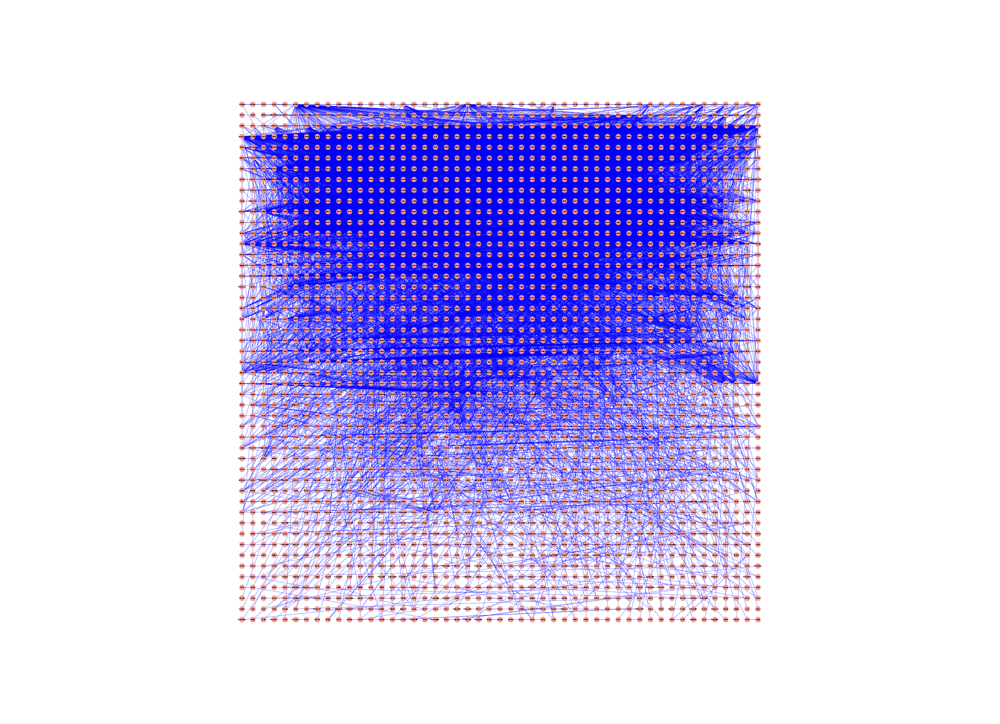

```{r, message = FALSE}
library(RCy3)
library(httr)
library(RJSONIO)
source("./functions_to_add_to_RCy3/working_with_namespaces.R")
```

# Trying out clusterMaker with R 

```{r}
cy <- CytoscapeConnection ()
getCommandsWithinNamespace(cy, "cluster")
```

Following this tutorial: 

http://opentutorials.cgl.ucsf.edu/index.php/Tutorial:Cluster_Maker

# Read in provided session file (.cys file)
```{r}
command.name <- "open"

request.uri <- paste(cy@uri,
                     pluginVersion(cy),
                     "commands/session",
                     as.character(command.name),
                     sep = "/")
## load session
properties.list <- list(file="/home/julia_g/windows_school/gsoc/gsoc_Rcy3_vignettes/data/GalFiltered.cys")
request.res <- GET(url = request.uri,
                   query = properties.list)

getWindowList(cy)

connect_window_to_R_session <- existing.CytoscapeWindow("galFiltered.sif",
                                                        copy.graph.from.cytoscape.to.R = FALSE)
```

Graph from session is loaded into Cytoscape

```{r}
getCommandsWithinNamespace(connect_window_to_R_session, "cluster/hierarchical")
getCommandsWithinNamespace(connect_window_to_R_session, "cluster/getcluster")
```

## Make clusters


```{r}
node_list <- c("gal1RGexp",
                  "gal4RGexp",
                  "gal80Rexp")

properties.list <- list(
  nodeAttributeList = paste(node_list[1],node_list[2],node_list[3], sep=","),
  network = connect_window_to_R_session@title,
  selectedOnly = FALSE,
  clusterAttributes = TRUE,
  ignoreMissing = FALSE,
  createGroups = TRUE,
  showUI = FALSE
)

command.name <- "hierarchical"
request.uri <- paste(connect_window_to_R_session@uri,
                     pluginVersion(cy),
                     "commands/cluster",
                     as.character(command.name),
                     sep = "/")

request.res <- GET(url = request.uri,
                   query = properties.list,
                   verbose())
request.res$url
http_status(request.res)
```

## Get clusters
Isn't really working for me.....
Need to run a second set of commands to get the clusters
```{r}
# command.name <- "getcluster"
# 
# properties.list <- list(algorithm = "hierarchical",
#                         network = connect_window_to_R_session@title,
#                         type = "node")
# 
# request.uri <- paste(connect_window_to_R_session@uri,
#                      pluginVersion(connect_window_to_R_session),
#                      "commands/cluster",
#                      as.character(command.name),
#                      sep = "/")
# 
# request.res <- GET(url = request.uri,
#                    query = properties.list,
#                    verbose())
# request.res$url
# http_status(request.res)
# request.res$status_code
```


This puts the clusters into the network table in Cytoscape.

How to work with this? Need to look at network table. 
```{r, cache=TRUE}
request.uri <- paste(connect_window_to_R_session@uri,
                     pluginVersion(connect_window_to_R_session),
                     "networks",
                     connect_window_to_R_session@window.id,
                     "tables/defaultnetwork",
                     sep = "/")

## can view at http://localhost:1234/v1/networks/15728/tables/defaultnetwork under node_clusters
request.res <- GET(request.uri) # returns all of the node SUIDs

cluster_content <- fromJSON(rawToChar(request.res$content))
  
## returns the clusters to which each node belongs.           
node_cluster_data <- cluster_content$rows[[1]]$`__nodeClusters`
```


```{r}
## how to split up tab separated data
library(reshape2)
split_node_cluster_data <- colsplit(node_cluster_data, "\t", names = c('a', 'b', 'c', 'd'))
## need to add to each cluster
## for each row, if 2nd row starts with group, then add it to that cluster
Cluster_list <- list(Cluster1 = split_node_cluster_data[1,1])
for (row in seq_along(2:nrow(split_node_cluster_data))){
  print(row)
  ## if node is in existing cluster
  if (grepl(split_node_cluster_data[row, 2], Cluster_list)||grepl(split_node_cluster_data[row, 3], Cluster_list) ){
     print("yay")
    # Cluster_list <- c(Cluster_list, )
    ## need the cluster and then need the new group
    grep("GROUP", split_node_cluster_data[row,], value=TRUE)
  }
}

```

## Try to network viz one:

# Read in provided session file (.cys file)
```{r}
command.name <- "open"

request.uri <- paste(cy@uri,
                     pluginVersion(cy),
                     "commands/session",
                     as.character(command.name),
                     sep = "/")
## load session
properties.list <- list(file="/home/julia_g/windows_school/gsoc/gsoc_Rcy3_vignettes/data/Collins.cys")
request.res <- GET(url = request.uri,
                   query = properties.list)

getWindowList(cy)

connect_window_to_R_session <- existing.CytoscapeWindow(getWindowList(cy),
                                                        copy.graph.from.cytoscape.to.R = FALSE)
```

Graph from session is loaded into Cytoscape

```{r}
getCommandsWithinNamespace(connect_window_to_R_session, "cluster/mcl")
getCommandsWithinNamespace(connect_window_to_R_session, "cluster/getnetworkcluster")
```

## Make clusters

Following the tutorial to make clusters based on an attribute and then show the clusters in Cytoscape. 

```{r}
properties.list <- list(
  attribute  = "PE Score",
  inflation_parameter = 2.0,
  showUI = TRUE,
  network = connect_window_to_R_session@title,
  selectedOnly = FALSE
)

command.name <- "mcl"
request.uri <- paste(connect_window_to_R_session@uri,
                     pluginVersion(cy),
                     "commands/cluster",
                     as.character(command.name),
                     sep = "/")

request.res <- GET(url = request.uri,
                   query = properties.list,
                   verbose())
```

```{r, echo=FALSE}
Sys.sleep(10)
saveImage(connect_window_to_R_session,
          "clustermaker_clusters_viz1",
          "png",
          h = 2000)

```


Colour different clusters by the cluster number. 
```{r}
data.values <- c(1:427)
library(RColorBrewer)
Dark_colours <- brewer.pal(8, "Dark2")
a_lot_of_dark_colours <- colorRampPalette(Dark_colours)(427)
  setNodeColorRule (connect_window_to_R_session,
                    node.attribute.name='__mclCluster',
                    data.values,
                    a_lot_of_dark_colours ,
                    mode='lookup',
                    default.color='#AA0000')
```

Need to connect to different window as notw called clustered....

```{r, echo=FALSE}
Sys.sleep(10)
saveImage(connect_window_to_R_session,
          "clustermaker_clusters_viz2",
          "png",
          h = 2000)

```
