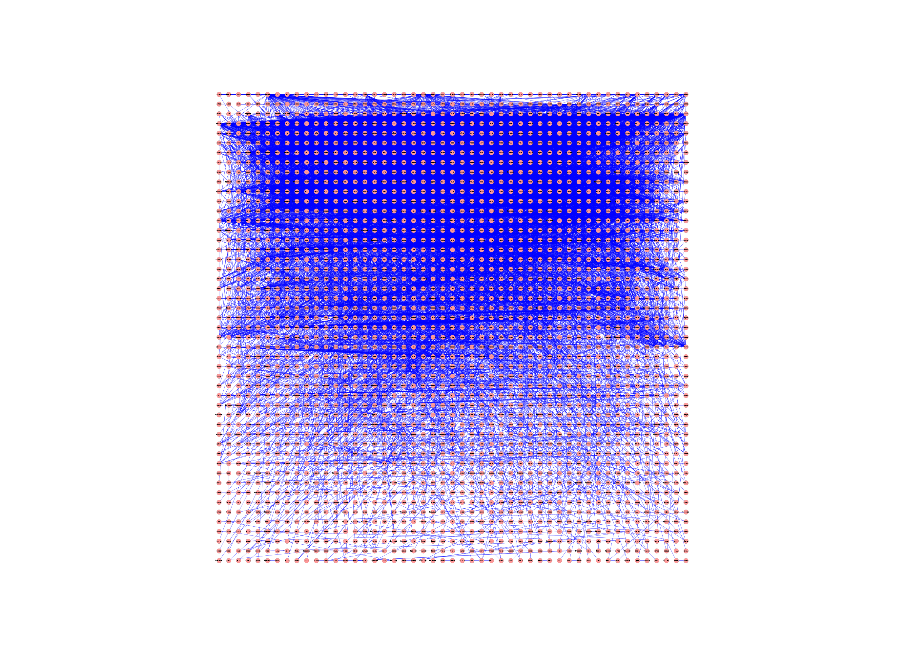

# cluster_maker
Julia Gustavsen  
June 23, 2016  


```r
library(RCy3)
library(httr)
library(RJSONIO)
source("./functions_to_add_to_RCy3/working_with_namespaces.R")
```

# Trying out clusterMaker with R 


```r
cy <- CytoscapeConnection ()
getCommandsWithinNamespace(cy, "cluster")
```

```
##  [1] "ap"                  "attribute"           "autosome_heatmap"   
##  [4] "autosome_network"    "bestneighbor"        "cheng&church"       
##  [7] "connectedcomponents" "cuttingedge"         "dbscan"             
## [10] "density"             "fcml"                "featurevector"      
## [13] "fft"                 "filter"              "fuzzifier"          
## [16] "getcluster"          "getnetworkcluster"   "glay"               
## [19] "haircut"             "hascluster"          "hierarchical"       
## [22] "hopach"              "kmeans"              "kmedoid"            
## [25] "mcl"                 "mcode"               "network"            
## [28] "pam"                 "scps"                "transclust"
```

Following this tutorial: 

http://opentutorials.cgl.ucsf.edu/index.php/Tutorial:Cluster_Maker

# Read in provided session file (.cys file)

```r
command.name <- "open"

request.uri <- paste(cy@uri,
                     pluginVersion(cy),
                     "commands/session",
                     as.character(command.name),
                     sep = "/")
## load session
properties.list <- list(file="/home/julia_g/windows_school/gsoc/gsoc_Rcy3_vignettes/data/GalFiltered.cys")
request.res <- GET(url = request.uri,
                   query = properties.list)

getWindowList(cy)
```

```
## [1] "galFiltered.sif"
```

```r
connect_window_to_R_session <- existing.CytoscapeWindow("galFiltered.sif",
                                                        copy.graph.from.cytoscape.to.R = FALSE)
```

Graph from session is loaded into Cytoscape


```r
getCommandsWithinNamespace(connect_window_to_R_session, "cluster/hierarchical")
```

```
##  [1] "adjustDiagonals"   "clusterAttributes" "createGroups"     
##  [4] "edgeAttributeList" "ignoreMissing"     "linkage"          
##  [7] "metric"            "network"           "nodeAttributeList"
## [10] "selectedOnly"      "showUI"            "zeroMissing"
```

```r
getCommandsWithinNamespace(connect_window_to_R_session, "cluster/getcluster")
```

```
## [1] "algorithm" "network"   "type"
```

## Make clusters


```r
node_list <- c("gal1RGexp",
                  "gal4RGexp",
                  "gal80Rexp")

properties.list <- list(
  nodeAttributeList = paste(node_list[1],node_list[2],node_list[3], sep=","),
  network = connect_window_to_R_session@title,
  selectedOnly = FALSE,
  clusterAttributes = TRUE,
  ignoreMissing = FALSE,
  createGroups = TRUE,
  showUI = FALSE
)

command.name <- "hierarchical"
request.uri <- paste(connect_window_to_R_session@uri,
                     pluginVersion(cy),
                     "commands/cluster",
                     as.character(command.name),
                     sep = "/")

request.res <- GET(url = request.uri,
                   query = properties.list,
                   verbose())
request.res$url
```

```
## [1] "http://localhost:1234/v1/commands/cluster/hierarchical?nodeAttributeList=gal1RGexp%2Cgal4RGexp%2Cgal80Rexp&network=galFiltered.sif&selectedOnly=FALSE&clusterAttributes=TRUE&ignoreMissing=FALSE&createGroups=TRUE&showUI=FALSE"
```

```r
http_status(request.res)
```

```
## $category
## [1] "Success"
## 
## $reason
## [1] "OK"
## 
## $message
## [1] "Success: (200) OK"
```

## Get clusters
Isn't really working for me.....
Need to run a second set of commands to get the clusters

```r
# command.name <- "getcluster"
# 
# properties.list <- list(algorithm = "hierarchical",
#                         network = connect_window_to_R_session@title,
#                         type = "node")
# 
# request.uri <- paste(connect_window_to_R_session@uri,
#                      pluginVersion(connect_window_to_R_session),
#                      "commands/cluster",
#                      as.character(command.name),
#                      sep = "/")
# 
# request.res <- GET(url = request.uri,
#                    query = properties.list,
#                    verbose())
# request.res$url
# http_status(request.res)
# request.res$status_code
```


This puts the clusters into the network table in Cytoscape.

How to work with this? Need to look at network table. 

```r
request.uri <- paste(connect_window_to_R_session@uri,
                     pluginVersion(connect_window_to_R_session),
                     "networks",
                     connect_window_to_R_session@window.id,
                     "tables/defaultnetwork",
                     sep = "/")

## can view at http://localhost:1234/v1/networks/15728/tables/defaultnetwork under node_clusters
request.res <- GET(request.uri) # returns all of the node SUIDs

cluster_content <- fromJSON(rawToChar(request.res$content))
  
## returns the clusters to which each node belongs.           
node_cluster_data <- cluster_content$rows[[1]]$`__nodeClusters`
```


```r
## how to split up tab separated data
library(reshape2)
split_node_cluster_data <- colsplit(node_cluster_data, "\t", names = c('a', 'b', 'c', 'd'))
## need to add to each cluster
## for each row, if 2nd row starts with group, then add it to that cluster
Cluster_list <- list(Cluster1 = split_node_cluster_data[1,1])
for (row in seq_along(2:nrow(split_node_cluster_data))){
  print(row)
  ## if node is in existing cluster
  if (grepl(split_node_cluster_data[row, 2], Cluster_list)||grepl(split_node_cluster_data[row, 3], Cluster_list) ){
     print("yay")
    # Cluster_list <- c(Cluster_list, )
    ## need the cluster and then need the new group
    grep("GROUP", split_node_cluster_data[row,], value=TRUE)
  }
}
```

```
## [1] 1
## [1] "yay"
## [1] 2
## [1] "yay"
## [1] 3
## [1] 4
## [1] 5
## [1] 6
## [1] 7
## [1] 8
## [1] 9
## [1] 10
## [1] 11
## [1] 12
## [1] 13
## [1] 14
## [1] 15
## [1] 16
## [1] 17
## [1] 18
## [1] 19
## [1] 20
## [1] 21
## [1] 22
## [1] 23
## [1] 24
## [1] 25
## [1] 26
## [1] 27
## [1] 28
## [1] 29
## [1] 30
## [1] 31
## [1] 32
## [1] 33
## [1] 34
## [1] 35
## [1] 36
## [1] 37
## [1] 38
## [1] 39
## [1] 40
## [1] 41
## [1] 42
## [1] 43
## [1] 44
## [1] 45
## [1] 46
## [1] 47
## [1] 48
## [1] 49
## [1] 50
## [1] 51
## [1] 52
## [1] 53
## [1] 54
## [1] 55
## [1] 56
## [1] 57
## [1] 58
## [1] 59
## [1] 60
## [1] 61
## [1] 62
## [1] 63
## [1] 64
## [1] 65
## [1] 66
## [1] 67
## [1] 68
## [1] 69
## [1] 70
## [1] 71
## [1] 72
## [1] 73
## [1] 74
## [1] 75
## [1] 76
## [1] 77
## [1] 78
## [1] 79
## [1] 80
## [1] 81
## [1] 82
## [1] 83
## [1] 84
## [1] 85
## [1] 86
## [1] 87
## [1] 88
## [1] 89
## [1] 90
## [1] 91
## [1] 92
## [1] 93
## [1] 94
## [1] 95
## [1] 96
## [1] 97
## [1] 98
## [1] 99
## [1] 100
## [1] 101
## [1] 102
## [1] 103
## [1] 104
## [1] 105
## [1] 106
## [1] 107
## [1] 108
## [1] 109
## [1] 110
## [1] 111
## [1] 112
## [1] 113
## [1] 114
## [1] 115
## [1] 116
## [1] 117
## [1] 118
## [1] 119
## [1] 120
## [1] 121
## [1] 122
## [1] 123
## [1] 124
## [1] 125
## [1] 126
## [1] 127
## [1] 128
## [1] 129
## [1] 130
## [1] 131
## [1] 132
## [1] 133
## [1] 134
## [1] 135
## [1] 136
## [1] 137
## [1] 138
## [1] 139
## [1] 140
## [1] 141
## [1] 142
## [1] 143
## [1] 144
## [1] 145
## [1] 146
## [1] 147
## [1] 148
## [1] 149
## [1] 150
## [1] 151
## [1] 152
## [1] 153
## [1] 154
## [1] 155
## [1] 156
## [1] 157
## [1] 158
## [1] 159
## [1] 160
## [1] 161
## [1] 162
## [1] 163
## [1] 164
## [1] 165
## [1] 166
## [1] 167
## [1] 168
## [1] 169
## [1] 170
## [1] 171
## [1] 172
## [1] 173
## [1] 174
## [1] 175
## [1] 176
## [1] 177
## [1] 178
## [1] 179
## [1] 180
## [1] 181
## [1] 182
## [1] 183
## [1] 184
## [1] 185
## [1] 186
## [1] 187
## [1] 188
## [1] 189
## [1] 190
## [1] 191
## [1] 192
## [1] 193
## [1] 194
## [1] 195
## [1] 196
## [1] 197
## [1] 198
## [1] 199
## [1] 200
## [1] 201
## [1] 202
## [1] 203
## [1] 204
## [1] 205
## [1] 206
## [1] 207
## [1] 208
## [1] 209
## [1] 210
## [1] 211
## [1] 212
## [1] 213
## [1] 214
## [1] 215
## [1] 216
## [1] 217
## [1] 218
## [1] 219
## [1] 220
## [1] 221
## [1] 222
## [1] 223
## [1] 224
## [1] 225
## [1] 226
## [1] 227
## [1] 228
## [1] 229
## [1] 230
## [1] 231
## [1] 232
## [1] 233
## [1] 234
## [1] 235
## [1] 236
## [1] 237
## [1] 238
## [1] 239
## [1] 240
## [1] 241
## [1] 242
## [1] 243
## [1] 244
## [1] 245
## [1] 246
## [1] 247
## [1] 248
## [1] 249
## [1] 250
## [1] 251
## [1] 252
## [1] 253
## [1] 254
## [1] 255
## [1] 256
## [1] 257
## [1] 258
## [1] 259
## [1] 260
## [1] 261
## [1] 262
## [1] 263
## [1] 264
## [1] 265
## [1] 266
## [1] 267
## [1] 268
## [1] 269
## [1] 270
## [1] 271
## [1] 272
## [1] 273
## [1] 274
## [1] 275
## [1] 276
## [1] 277
## [1] 278
## [1] 279
## [1] 280
## [1] 281
## [1] 282
## [1] 283
## [1] 284
## [1] 285
## [1] 286
## [1] 287
## [1] 288
## [1] 289
## [1] 290
## [1] 291
## [1] 292
## [1] 293
## [1] 294
## [1] 295
## [1] 296
## [1] 297
## [1] 298
## [1] 299
## [1] 300
## [1] 301
## [1] 302
## [1] 303
## [1] 304
## [1] 305
## [1] 306
## [1] 307
## [1] 308
## [1] 309
## [1] 310
## [1] 311
## [1] 312
## [1] 313
## [1] 314
## [1] 315
## [1] 316
## [1] 317
## [1] 318
## [1] 319
## [1] 320
## [1] 321
## [1] 322
## [1] 323
## [1] 324
## [1] 325
## [1] 326
## [1] 327
## [1] 328
## [1] 329
```

## Try to network viz one:

# Read in provided session file (.cys file)

```r
command.name <- "open"

request.uri <- paste(cy@uri,
                     pluginVersion(cy),
                     "commands/session",
                     as.character(command.name),
                     sep = "/")
## load session
properties.list <- list(file="/home/julia_g/windows_school/gsoc/gsoc_Rcy3_vignettes/data/Collins.cys")
request.res <- GET(url = request.uri,
                   query = properties.list)

getWindowList(cy)
```

```
## [1] "combined_scores_good.txt"
```

```r
connect_window_to_R_session <- existing.CytoscapeWindow(getWindowList(cy),
                                                        copy.graph.from.cytoscape.to.R = FALSE)
```

Graph from session is loaded into Cytoscape


```r
getCommandsWithinNamespace(connect_window_to_R_session, "cluster/mcl")
```

```
##  [1] "adjustLoops"         "attribute"           "clusterAttribute"   
##  [4] "clusteringThresh"    "createGroups"        "edgeCutOff"         
##  [7] "edgeWeighter"        "inflation_parameter" "iterations"         
## [10] "maxResidual"         "maxThreads"          "network"            
## [13] "restoreEdges"        "selectedOnly"        "showUI"             
## [16] "undirectedEdges"
```

```r
getCommandsWithinNamespace(connect_window_to_R_session, "cluster/getnetworkcluster")
```

```
## [1] "algorithm" "network"
```

## Make clusters

Following the tutorial to make clusters based on an attribute and then show the clusters in Cytoscape. 


```r
properties.list <- list(
  attribute  = "PE Score",
  inflation_parameter = 2.0,
  showUI = TRUE,
  network = connect_window_to_R_session@title,
  selectedOnly = FALSE
)

command.name <- "mcl"
request.uri <- paste(connect_window_to_R_session@uri,
                     pluginVersion(cy),
                     "commands/cluster",
                     as.character(command.name),
                     sep = "/")

request.res <- GET(url = request.uri,
                   query = properties.list,
                   verbose())
```




Colour different clusters by the cluster number. 

```r
data.values <- c(1:427)
library(RColorBrewer)
Dark_colours <- brewer.pal(8, "Dark2")
a_lot_of_dark_colours <- colorRampPalette(Dark_colours)(427)
  setNodeColorRule (connect_window_to_R_session,
                    node.attribute.name='__mclCluster',
                    data.values,
                    a_lot_of_dark_colours ,
                    mode='lookup',
                    default.color='#AA0000')
```

```
## Successfully set rule.
```


