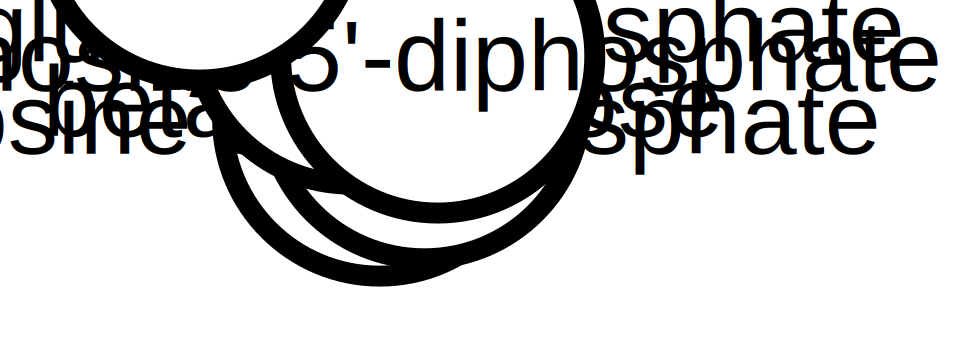
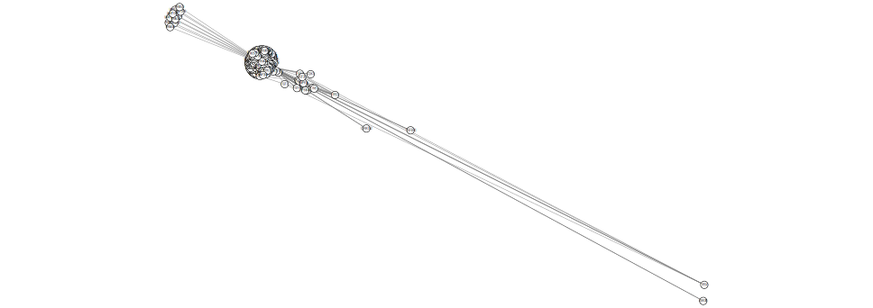
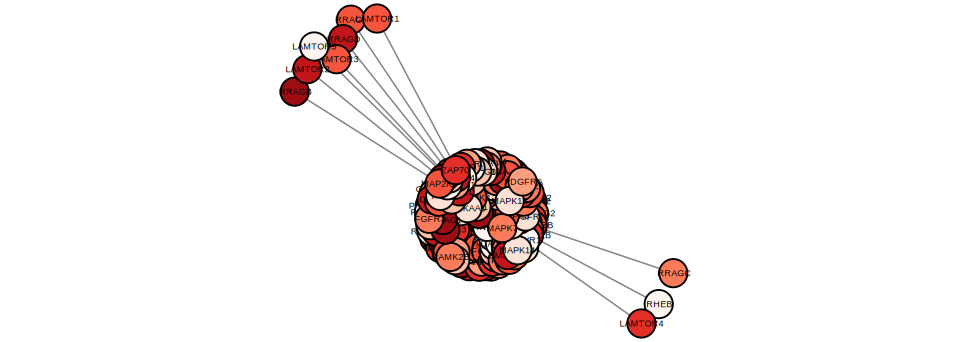

```{r setup, include=FALSE}
knitr::opts_chunk$set(echo = TRUE)
```

```{r}
library(paxtoolsr)
library(RCy3)
```

# Outline
-introduction
  - what will this vignette do?
  - what is an interesting dataset I could use from Pathway Commons?
- what does does paxtools r do?
  - leverages tools from this other library
  - for more info go here...
- discuss SIF?
-convert one to a Gene set enrichment analysis?
- search for a certain kind of pathway commons network...and then viz....
"A common use case for paxtoolsr to retrieve a network or sub-network from a pathway derived from a BioPAX file or a Pathway Commons query."
so really this 7.1 should be done...

```{r}
searchResults <- searchPc(q = "glycolysis", type = "pathway")
```

```{r}
# searchResults <- xpathSApply(searchResults, "/searchResponse/searchHit/uri", 
#     xmlValue)
# 
# ## Generate temporary file to save content into
# biopaxFile <- tempfile()
# 
# ## Extract a URI for a pathway in the search results and save into a file
# idx <- which(grepl("panther", simplifiedSearchResultsDf$uri) & grepl("glycolysis", 
#     simplifiedSearchResultsDf$name, ignore.case = TRUE))
# uri <- simplifiedSearchResultsDf$uri[idx]
# saveXML(getPc(uri, "BIOPAX"), biopaxFile)
```

# Visualize a network using paxtoolsr

```{r}
sif <- toSif(system.file("extdata", "biopax3-short-metabolic-pathway.owl", package = "paxtoolsr"))
library(igraph)
# graph.edgelist requires a matrix
g <- graph.edgelist(as.matrix(sif[, c(1, 3)]), directed = FALSE)

g.nodes <- as.data.frame(vertex.attributes(g))
g.edges <- data.frame(as_edgelist(g))
names(g.edges) <- c("name.1",
                          "name.2")

ug <- cyPlot(g.nodes,g.edges)
```

## Send network to Cytoscape using RCy3

```{r, message=FALSE}
cw <- CytoscapeWindow("Metabolic pathway from paxtoolsr",
                      graph = ug,
                      overwriteWindow = TRUE)
```

```{r, message=FALSE, results="hide"}
displayGraph(cw)
layoutNetwork(cw, "fruchterman-rheingold")
```

```{r, echo=FALSE}
saveImage(cw,
          "paxtools_met_path_1",
          "svg")

```

# Pathway Commons Graph Query (from 7.2)

```{r}
gene <- "BDNF"
t1 <- graphPc(source = gene, kind = "neighborhood", format = "BINARY_SIF", verbose = TRUE)
```

```{r}
t2 <- t1[which(t1[, 2] == "controls-state-change-of"), ]

g <- graph.edgelist(as.matrix(t2[, c(1, 3)]), directed = FALSE)
```

```{r}
g.nodes <- as.data.frame(vertex.attributes(g))
g.edges <- data.frame(as_edgelist(g))
names(g.edges) <- c("name.1",
                          "name.2")

ug <- cyPlot(g.nodes,g.edges)
```

## Send network to Cytoscape using RCy3

```{r, message=FALSE}
cw <- CytoscapeWindow("Pathway Commons graph query from paxtoolsr",
                      graph = ug,
                      overwriteWindow = TRUE)
```

```{r, message=FALSE, results="hide"}
displayGraph(cw)
layoutNetwork(cw, "fruchterman-rheingold")
```

```{r, echo=FALSE}
saveImage(cw,
          "pathway_commons_gq",
          "svg")

```

# 7.3 Subnetwork...

```{r}
genes <- c("AKT1", "IRS1", "MTOR", "IGF1R")
t1 <- graphPc(source = genes, kind = "PATHSBETWEEN", format = "BINARY_SIF", 
    verbose = TRUE)
```

```{r}
t2 <- t1[which(t1[, 2] == "controls-state-change-of"), ]

g <- graph.edgelist(as.matrix(t2[, c(1, 3)]), directed = FALSE)
```

```{r}
g.nodes <- as.data.frame(vertex.attributes(g))
g.edges <- data.frame(as_edgelist(g))
names(g.edges) <- c("name.1",
                          "name.2")

ug <- cyPlot(g.nodes,g.edges)
```

## Send network to Cytoscape using RCy3

```{r, message=FALSE}
cw <- CytoscapeWindow("Subnetwork of Pathway Commons graph query from paxtoolsr",
                      graph = ug,
                      overwriteWindow = TRUE)
```

```{r, message=FALSE, results="hide"}
displayGraph(cw)
layoutNetwork(cw, "fruchterman-rheingold")
```

```{r, echo=FALSE}
saveImage(cw,
          "subnet_pathway_commons_gq",
          "svg")

```

# Adding metadata to Pathway commons networks (7.3)

add something real in?
```{r}
library(RColorBrewer)

# Generate a color palette that goes from white to red that contains 10
# colors
numColors <- 10
colors <- colorRampPalette(brewer.pal(9, "Reds"))(numColors)

# Generate values that could represent some experimental values
values <- runif(length(V(g)$name))

# Scale values to generate indicies from the color palette
xrange <- range(values)
newrange <- c(1, numColors)

factor <- (newrange[2] - newrange[1])/(xrange[2] - xrange[1])
scaledValues <- newrange[1] + (values - xrange[1]) * factor
indicies <- as.integer(scaledValues)

# Color the nodes based using the indicies and the color palette created
# above
g <- set.vertex.attribute(g, "color", value = colors[indicies])
g <- set.vertex.attribute(g, "indicies", value = indicies)
```

```{r}
g.nodes <- as.data.frame(vertex.attributes(g))
g.edges <- data.frame(as_edgelist(g))
names(g.edges) <- c("name.1",
                          "name.2")
g.nodes$color <- vertex_attr(g)[[2]]
g.nodes$indicies <- vertex_attr(g)[[3]]

ug <- cyPlot(g.nodes,g.edges)
```

## Send network to Cytoscape using RCy3

```{r, message=FALSE}
cw <- CytoscapeWindow("Coloured network paxtoolsr",
                      graph = ug,
                      overwriteWindow = TRUE)
```

```{r, message=FALSE, results="hide"}
displayGraph(cw)
layoutNetwork(cw, "fruchterman-rheingold")
```

```{r}
setNodeColorRule(cw,
                 'indicies',
                 control.points = as.character(c(1:10)),
                 colors,
                 "lookup",
                 default.color='#ffffff')
```


```{r, echo=FALSE}
saveImage(cw,
          "coloured_paxtoolsr_ex",
          "svg")

```
