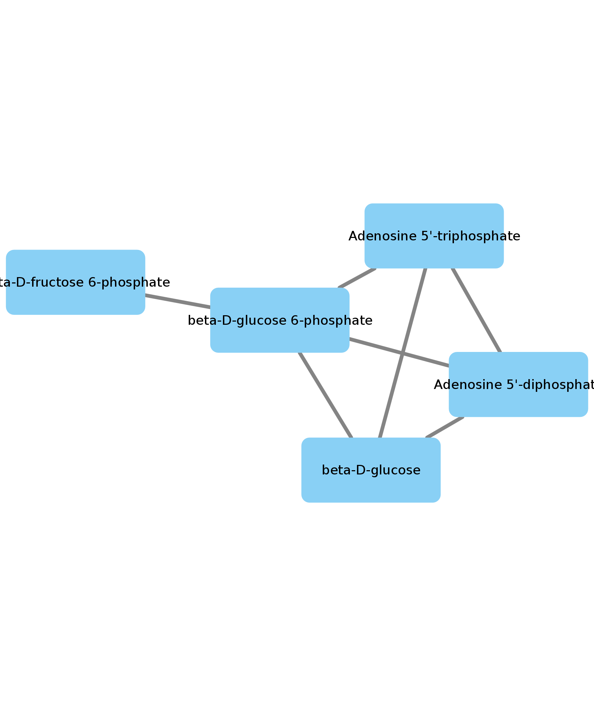
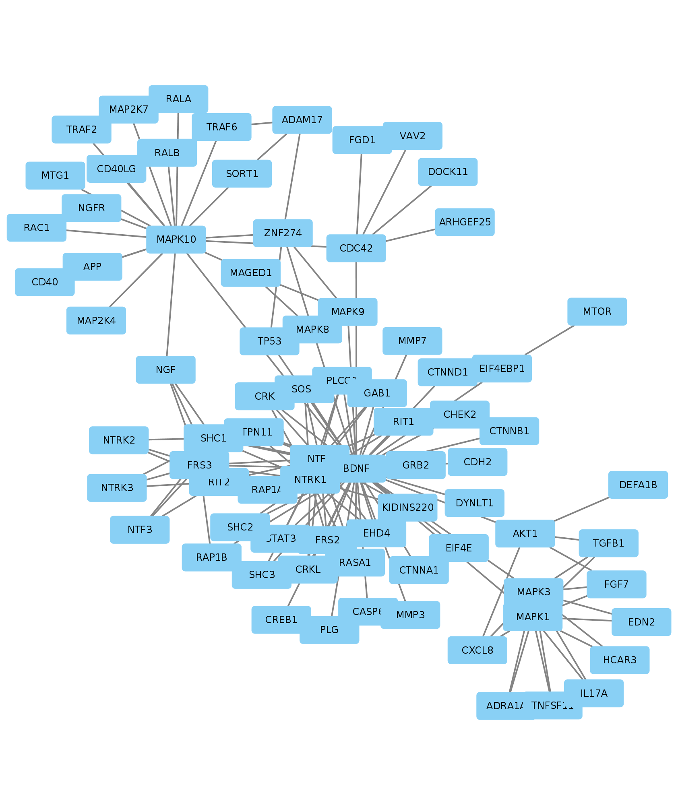
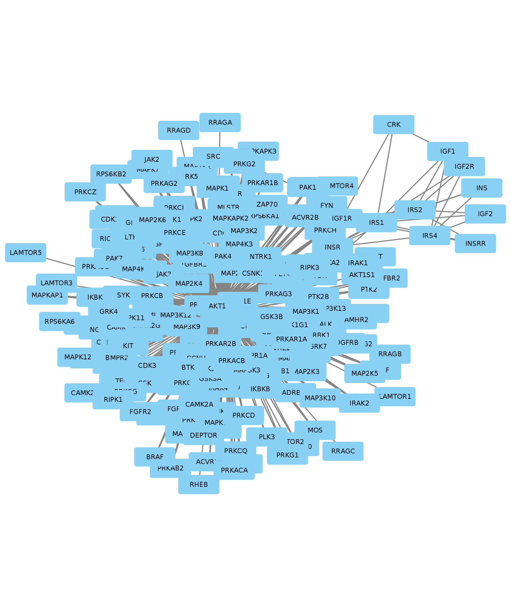
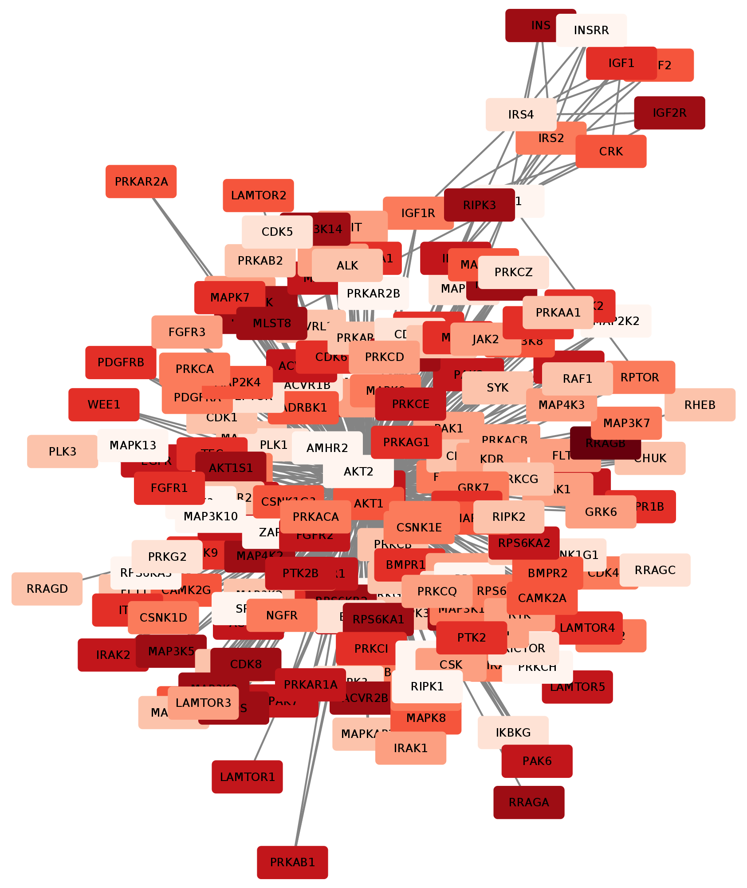

# Purpose

This vignette will show how to visualize networks retrieved using paxtoolsr [@luna_paxtoolsr:_2015] in Cytoscape [@shannon_cytoscape:_2003 ; @ono_cyrest:_2015] using RCy3. Paxtoolsr leverages the tools developped in the java toolkit paxtools to retrieve information from Pathway commons,retrieve a network or subnetwork related to a particular pathway. For more information please see @luna_paxtoolsr:_2015 and have a look at the paxtoolsr vignette:

```
library(paxtoolsr)
browseVignettes("paxtoolsr")
```

Load packages for use in this tutorial
```{r, message = FALSE}
library(paxtoolsr)
library(RCy3)
library(igraph)
library(RColorBrewer)
```

# Visualize a network using paxtoolsr

Here we will use paxtoolsr to convert a metabolic pathway file to the Simple Interaction Format (SIF). 
```{r}
sif <- toSif(system.file("extdata", "biopax3-short-metabolic-pathway.owl", package = "paxtoolsr"))
```
We will use igraph to create a network from the SIF file and then convert that to node and edge lists that can be sent to Cytoscape via RCy3. 
```{r}
g <- graph.edgelist(as.matrix(sif[, c(1, 3)]), directed = FALSE)

g.nodes <- as.data.frame(vertex.attributes(g))
g.edges <- data.frame(as_edgelist(g))
names(g.edges) <- c("name.1",
                    "name.2")

ug <- cyPlot(g.nodes,g.edges)
```

## Send network to Cytoscape using RCy3

```{r, message=FALSE}
cw <- CytoscapeWindow("Metabolic pathway from paxtoolsr",
                      graph = ug,
                      overwriteWindow = TRUE)
```

```{r, message=FALSE, results="hide"}
displayGraph(cw)
layoutNetwork(cw, "force-directed")
```

```{r, echo=FALSE}
saveImage(cw,
          "paxtools_met_path_1",
          "png")

```

# Pathway Commons Graph Query

Paxtoolsr can also be used to query Pathway Commons for the neighbours of a particular gene. In this case we will examine the gene neighbourhood of gene Brain-derived neurotrophic factor( BDNF) and is involved in neuron growth and survival. 
```{r}
gene <- "BDNF"
t1 <- graphPc(source = gene, kind = "neighborhood", format = "BINARY_SIF", verbose = TRUE)
```
For our network we only want to visualize interaction where BDNF controls a reactions that changes the state of the second protein ("controls-state-change-of", see more info on the binary relations in Pathway commons [here](http://www.pathwaycommons.org/pc2/formats).  
```{r}
t2 <- t1[which(t1[, 2] == "controls-state-change-of"), ]
```
We will use this filtered dataframe to create a network using igraph's `graph.edgelist()`
```{r}
g <- graph.edgelist(as.matrix(t2[, c(1, 3)]), directed = FALSE)
```
Format the graph for sending to Cytoscape.
```{r}
g.nodes <- as.data.frame(vertex.attributes(g))
g.edges <- data.frame(as_edgelist(g))
names(g.edges) <- c("name.1",
                    "name.2")

ug <- cyPlot(g.nodes,g.edges)
```

## Send network to Cytoscape using RCy3

```{r, message=FALSE}
cw <- CytoscapeWindow("Pathway Commons graph query from paxtoolsr",
                      graph = ug,
                      overwriteWindow = TRUE)
```

```{r, message=FALSE, results="hide"}
displayGraph(cw)
layoutNetwork(cw, "force-directed")
```

```{r, echo=FALSE}
saveImage(cw,
          "pathway_commons_gq",
          "png")

```

# 7.3 Create a subnetwork from a set of proteins

We will examine a network looking at genes AKT serine/threonine kinase 1 ("AKT1"), Insulin receptor substrate 1("IRS1"), mechanistic target of rapamycin("MTOR") and Insulin Like Growth Factor 1 Receptor ("IGF1R") and find all the paths that are between these genes. 
```{r}
genes <- c("AKT1", "IRS1", "MTOR", "IGF1R")
t1 <- graphPc(source = genes, kind = "PATHSBETWEEN", format = "BINARY_SIF", 
              verbose = TRUE)
```
We will again filter our network to visualize interactions where the genes control a reactions that changes the state of the second gene protein ("controls-state-change-of", see more info [here](http://www.pathwaycommons.org/pc2/formats).  
```{r}
t2 <- t1[which(t1[, 2] == "controls-state-change-of"), ]
```
Create graph using igraph.
```{r}
g <- graph.edgelist(as.matrix(t2[, c(1, 3)]), directed = FALSE)
```
Convert graph to node and edges lists to send to Cytoscape.
```{r}
g.nodes <- as.data.frame(vertex.attributes(g))
g.edges <- data.frame(as_edgelist(g))
names(g.edges) <- c("name.1",
                    "name.2")

ug <- cyPlot(g.nodes,g.edges)
```

## Send network to Cytoscape using RCy3

```{r, message=FALSE}
cw <- CytoscapeWindow("Subnetwork of Pathway Commons graph query from paxtoolsr",
                      graph = ug,
                      overwriteWindow = TRUE)
```

```{r, message=FALSE, results="hide"}
displayGraph(cw)
showGraphicsDetails(cw, new.value)
layoutNetwork(cw, "force-directed")
```

```{r, echo=FALSE}
saveImage(cw,
          "subnet_pathway_commons_gq",
          "png")

```

# Adding metadata to Pathway commons networks

It can be useful to overlay data from experiments or other sources onto the nodes and edges of a network. We will do this by simulating some data that will be used to colour the nodes of the network. 

```{r}
# Generate a color palette that goes from white to red that contains 10
# colors
numColors <- 10
colors <- colorRampPalette(brewer.pal(9, "Reds"))(numColors)

# Generate values that could represent some experimental values
values <- runif(length(V(g)$name))

# Scale values to generate indices from the color palette
xrange <- range(values)
newrange <- c(1, numColors)

factor <- (newrange[2] - newrange[1])/(xrange[2] - xrange[1])
scaledValues <- newrange[1] + (values - xrange[1]) * factor
indices <- as.integer(scaledValues)
```
After the colours and values for the nodes have been generated, we will add this information to the network that we used in the previous section.
```{r}
# Color the nodes based using the indices and the color palette created
# above
g <- set.vertex.attribute(g, "color", value = colors[indices])
g <- set.vertex.attribute(g, "indices", value = indices)
```

Make node and edgelists and make sure to include the appropriate attributes for sending to Cytoscape.
```{r}
g.nodes <- as.data.frame(vertex.attributes(g))
g.edges <- data.frame(as_edgelist(g))
names(g.edges) <- c("name.1",
                    "name.2")
g.nodes$color <- vertex_attr(g)[[2]]
g.nodes$indices <- vertex_attr(g)[[3]]

ug <- cyPlot(g.nodes,g.edges)
```

## Send network to Cytoscape using RCy3

```{r, message=FALSE}
cw <- CytoscapeWindow("Coloured network paxtoolsr",
                      graph = ug,
                      overwriteWindow = TRUE)
```

```{r, message=FALSE, results="hide"}
displayGraph(cw)
layoutNetwork(cw, "force-directed")
```

Now use the information contained in the "indices" column to add the colours to the nodes in Cytoscape. 
```{r}
setNodeColorRule(cw,
                 'indices',
                 control.points = as.numeric(c(1.0:10.0)), # needs to match type of column in Cytoscape
                 colors,
                 "lookup",
                 default.color='#ffffff')
```

```{r, echo=FALSE}
saveImage(cw,
          "coloured_paxtoolsr_ex",
          "png")

```

# References
