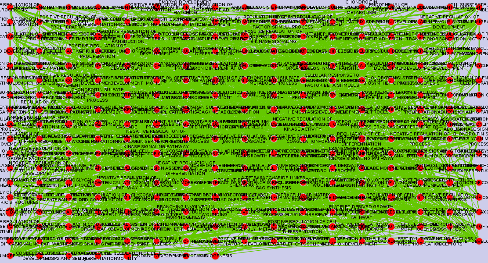

# Purpose: 

* Recreating tutorials from Bader lab (link) using Rcy3 and cytoscape.
* creating functions using RCy3 that make it easy to use Enrichment Map

```{r, message = FALSE}
library(RCy3)
library(httr)
library(RJSONIO)
```

* Make sure cytoscape is open!

## Reference for the API

found this page which is helpful for the api:

http://idekerlab.github.io/cyREST/#1637304040

## Finding command names available in Cytoscape using R

Finally found: 

http://localhost:1234/v1/commands

Which gives the same as when you type `help` in the Command Line Dialog in cytoscape

```{r}
## create function to get command names for available plugins from Cytoscape
setGeneric ('getCommandNames', 
            signature='obj',
            function(obj) standardGeneric ('getCommandNames'))

setMethod('getCommandNames',
          'CytoscapeConnectionClass',
          function(obj) { 
            request.uri <- paste(obj@uri,
                                 pluginVersion(obj),
                                 "commands",
                                 sep="/")
            request.res <- GET(url=request.uri)
            
            available.commands <- unlist(strsplit(rawToChar(request.res$content),
                                                  split="\n\\s*"))
            ## to remove "Available namespaces" title
            ## remove the first value
            available.commands <- available.commands[-1]
            return(available.commands) 
          })
```

Test out the function to see what commands are available in Cytoscape
```{r}
cy <- CytoscapeConnection ()
getCommandNames(cy)
```

### Accessing the commands within Enrichment map?

```{r}
port.number = 1234
base.url = paste("http://localhost:",
                 toString(port.number),
                 "/v1",
                 sep="")
base.url
commands_enrichment_map.uri <- paste(base.url,
                                     "commands/enrichmentmap",
                                     sep="/")

request.res <- GET(url = commands_enrichment_map.uri )
request.res
```

Now try to extend the function to be able to find commands from a specific plugin?

```{r}
## make function to get commands from Enrichment map
setGeneric ('getCommandNamesEnrichmentMap', 
            signature = 'obj',
            function(obj) standardGeneric ('getCommandNamesEnrichmentMap'))

setMethod('getCommandNamesEnrichmentMap',
          'CytoscapeConnectionClass',
          function(obj) { 
            request.uri <- paste(obj@uri,
                                 pluginVersion(obj),
                                 "commands/enrichmentmap",
                                 sep = "/")
            request.res <- GET(url = request.uri)
            
            available.commands <- unlist(strsplit(rawToChar(request.res$content),
                                                  split = "\n\\s*"))
            ## remove "Available commands" title
            available.commands <- available.commands[-1]
            return(available.commands) })

cy <- CytoscapeConnection ()
str(getCommandNamesEnrichmentMap(cy))

```


### Make a function to look for commands within different plugins.


```{r}
## make function to get commands from Enrichment map
setGeneric ('getCommandsWithinNamespace', 
            signature = 'obj',
            function(obj,
                     namespace) standardGeneric ('getCommandsWithinNamespace'))

setMethod('getCommandsWithinNamespace',
          'CytoscapeConnectionClass',
          function(obj,
                   namespace) { 
            request.uri <- paste(obj@uri,
                                 pluginVersion(obj),
                                 "commands",
                                 namespace,
                                 sep = "/")
            request.res <- GET(url = request.uri)
            
            available.commands <- unlist(strsplit(rawToChar(request.res$content),
                                                  split = "\n\\s*"))
            ## remove "Available commands" title
            available.commands <- available.commands[-1]
            return(available.commands) })
```

Test out using different namespaces
```{r}
cy <- CytoscapeConnection ()
str(getCommandsWithinNamespace(cy, "enrichmentmap"))
getCommandsWithinNamespace(cy, "layout")
getCommandsWithinNamespace(cy, "cluster")
getCommandsWithinNamespace(cy, "network")
```


## Enrichment map stuff

### For reference list of arguments for EnrichmentMap "build"
```help enrichmentmap build```
analysisType=<ListSingleSelection GSEA|generic|DAVID/BiNGO/Great)>: Analysis Type
classDataset1=<File>: Classes
classDataset2=<File>: Classes
coeffecients=<ListSingleSelection (OVERLAP|JACCARD|COMBINED)>: Similarity Coeffecient
enrichments2Dataset1=<File>: Enrichments 2
enrichments2Dataset2=<File>: Enrichments 2
enrichmentsDataset1=<File>: Enrichments
enrichmentsDataset2=<File>: Enrichments
expressionDataset1=<File>: Expression
expressionDataset2=<File>: Expression
gmtFile=<File>: GMT
phenotype1Dataset1=<String>: Phenotype1
phenotype1Dataset2=<String>: Phenotype1
phenotype2Dataset1=<String>: Phenotype2
phenotype2Dataset2=<String>: Phenotype2
pvalue=<Double>: P-value Cutoff
qvalue=<Double>: FDR Q-value Cutoff
ranksDataset1=<File>: Ranks
ranksDataset2=<File>: Ranks
similaritycutoff=<Double>: Similarity Cutoff

### For reference list of arguments for EnrichmentMap gseabuild
```help enrichmentmap gseabuild``` at Cytoscape command line
enrichmentmap gseabuild arguments:
combinedconstant=<Double>: combinedconstant
edbdir=<String>: edbdir
edbdir2=<String>: edbdir2
expressionfile=<String>: expressionfile
expressionfile2=<String>: expressionfile2
overlap=<Double>: overlap
pvalue=<Double>: P-value Cutoff
qvalue=<Double>: FDR Q-value Cutoff
similaritymetric=<ListSingleSelection (OVERLAP|JACCARD|COMBINED)>: similaritymetric


```{r}
# setGeneric ('getEnrichmentMapCommands', 
# 	signature='obj', function(obj) standardGeneric ('getEnrichmentMapCommands'))
setGeneric ('getEnrichmentMapCommandsNames',	
	signature='obj', function(obj, command.name) standardGeneric ('getEnrichmentMapCommandsNames'))

getCommandNamesEnrichmentMap(cy)
```

```{r}
## need to specify which one would be most useful here? build or gseabuild or just make stuff for both?
            
#http://localhost:1234/v1/commands/enrichmentmap/build/

setMethod('getEnrichmentMapCommandsNames',
          'CytoscapeConnectionClass', 
          function(obj,
                   command.name) {
            request.uri <- paste(obj@uri,
                                 pluginVersion(obj),
                                 "commands/enrichmentmap",
                                 as.character(command.name),
                                 sep="/")
            request.res <- GET(url=request.uri)
            
            command.property.names <-unlist(strsplit(rawToChar(request.res$content),
                                                    split = "\n\\s*"))
            ## how to remove "Available commands ..."?
            ## not happy with this
            command.property.names <- command.property.names[-1]
            
            return(command.property.names)
            
          })## END getEnrichmentMapCommandsNames

getEnrichmentMapCommandsNames(cy, "build")
getEnrichmentMapCommandsNames(cy, "gseabuild")
```

## Send data to the cytoscape network

Use data from the Bader lab tutorial
```{r}
## Note: You cannot use relative paths in this,
## it needs to be the absolute path
path_to_file="/home/julia_g/windows_school/gsoc/EM-tutorials-docker/notebooks/data/"

enr_file = paste(path_to_file,
                 "gprofiler_results_mesenonly_ordered_computedinR.txt",
                 sep="")
```

```{r}
#' Runs Enrichment Map with a list of parameters.
#'
#' @param object Cytoscape network where Enrichment Map is run via RCy3 
#' @param 
#' @return An enrichmentMap 
#'
#' @concept RCy3
#' @export
#' 
#' @importFrom methods setGeneric

setGeneric('setEnrichmentMapProperties', 
            signature='obj',
            function(obj,
                     command.name,
                     properties.list, 
                     copy.graph.to.R = FALSE) standardGeneric('setEnrichmentMapProperties')
           )

setMethod('setEnrichmentMapProperties',
          'CytoscapeConnectionClass', 
          function(obj,
                   command.name,
                   properties.list, 
                   copy.graph.to.R = FALSE) {
            all.possible.props <- getEnrichmentMapCommandsNames(obj,
                                                                command.name)
            if (all(names(properties.list) %in% all.possible.props) == FALSE) {
              print('You have included a name which is not in the commands')
              stderr ()
            } else {
              request.uri <- paste(obj@uri,
                                   pluginVersion(obj),
                                   "commands/enrichmentmap",
                                   as.character(command.name),
                                   sep = "/")
              
              request.res <- GET(url = request.uri,
                                 query = properties.list)
              if (request.res$status == 200){
                print("Successfully built the EnrichmentMap.")
                stdout ()
                resource.uri <- paste(cy@uri,
                                      pluginVersion(cy),
                                      "networks",
                                      sep = "/")
                request.res <- GET(resource.uri)
                # SUIDs list of the existing Cytoscape networks	
                cy.networks.SUIDs <- fromJSON(rawToChar(request.res$content))
                # most recently made enrichment map will have the highest SUID
                cy.networks.SUIDs.last <- max(cy.networks.SUIDs)
                
                res.uri.last <- paste(cy@uri,
                                      pluginVersion(cy),
                                      "networks",
                                      as.character(cy.networks.SUIDs.last),
                                      sep = "/")
                result <- GET(res.uri.last)
                net.name <- fromJSON(rawToChar(result$content))$data$name
                
                if (copy.graph.to.R){
                  connect_EM_to_R_session <- existing.CytoscapeWindow(net.name,
                                                                       copy.graph.from.cytoscape.to.R = TRUE)
                  print(paste0("Cytoscape window",
                               net.name,
                               " successfully connected to R session and graph copied to R."))
                } 
                else {
                  connect_EM_to_R_session <- existing.CytoscapeWindow(net.name,
                                                                       copy.graph.from.cytoscape.to.R = FALSE) 
                  print(paste0("Cytoscape window ",
                               net.name,
                               " successfully connected to R session."))
                }
                
                
              } else {
                print("Something went wrong. Unable to build EnrichmentMap")
                stderr ()
              }
              invisible(request.res)
            }
            return(connect_EM_to_R_session)
          }) 

em_params <- list(analysisType = "generic",
                  enrichmentsDataset1 = enr_file,
                  pvalue = "1.0",
                  qvalue = "0.00001",
                  #expressionDataset1 = exp_file, 
                  similaritycutoff = "0.25",
                  coeffecients = "JACCARD")

## no graph is returned, just the connection to the graph
EM_1 <- setEnrichmentMapProperties(cy,
                                  "build",
                                  em_params)
```

Is there a situation where using the last made window for this enrichment map will fail? What other option could I find?

```{r}
saveImage(EM_1,
          "EM_1",
          "png",
          scale=4)
```


```{r}
print(noa.names(getGraph(EM_1)))

## test setting layout from R
layoutNetwork(EM_1,
                  'grid')

saveImage(EM_1,
          "EM_1_gridded",
          "png",
          scale=4)
```


```{r, cache = TRUE}
saveNetwork(EM_1, "EM_1")    
EM_1@graph

## if we want the graph data to be returned
## this part is slooooow!
EM_1_2 <- setEnrichmentMapProperties(cy,
                                   "build",
                                   em_params,
                                   copy.graph.to.R = TRUE)
print(noa.names(getGraph(EM_1_2)))

saveImage(EM_1_2,
          "EM_1_2",
          "png",
          scale=4)

```


## Following :
[Protocol 4 - Summarize Enrichment Results with Enrichment] Maps(https://github.com/BaderLab/EM-tutorials-docker/blob/master/notebooks/Protocol%204%20-%20Summarize%20Enrichment%20Results%20with%20Enrichment%20Maps.ipynb)

### Option 1: Load enrichment results from g:Profiler
```{r}
path_to_file="/home/julia_g/windows_school/gsoc/EM-tutorials-docker/notebooks/data/"

enr_file = paste0(path_to_file,
                 "gprofiler_results_mesenonly_ordered.txt")

expression_RNA_seq <- paste0(path_to_file,
                               "MesenchymalvsImmunoreactive_RNSseq_expression.txt")

ranks_file <- paste0(path_to_file,
                      "MesenchymalvsImmunoreactive_RNA_seq_ranks.rnk")
classes_file <- paste0(path_to_file,
                      "MesenchymalvsImmunoreactive_RNAseq_classes.cls")

# Phenotype - In the text boxes replace "UP" with "Mesenchymal" and "DOWN" with Immunoreactive. Mesenchymal will be associated with red nodes because it corresponds to the positive phenotype in the gprofiler_results_mesenonly_ordered.

em_params <- list(analysisType = "generic",
                  enrichmentsDataset1 = enr_file,
                  pvalue = "1.0",
                  qvalue = "0.0001",
                  #expressionDataset1 = expression_RNA_seq, 
                  #ranksDataset1 = ranks_file,
                  classDataset1 = classes_file,
                  phenotype1Dataset1 ="Mesenchymal",
                  phenotype2Dataset1 ="Immunoreactive",
                  similaritycutoff = "0.25",
                  coeffecients = "JACCARD")

EM_ex_4 <- setEnrichmentMapProperties(cy,
                                  "build",
                                  em_params)

```


```{r}
saveImage(EM_ex_4,
          "EM_ex_4",
          "png",
          scale=4)
```


### Option 2: Load enrichment results from GSEA

```{r}

path_to_file="/home/julia_g/windows_school/gsoc/EM-tutorials-docker/notebooks/data/"

gmt_file = paste0(path_to_file,
                 "Human_GOBP_AllPathways_no_GO_iea_December_24_2015_symbol.gmt")
expression_file <- paste0(path_to_file,
                          "MesenchymalvsImmunoreactive_RNSseq_expression.txt")
## come back here! was running
# enrichments_1 <- paste0(path_to_file,
#                         )
# 
# Enrichments 1- gsea_home/output/[data]/ Mesen_vs_Immuno_edgeR.GseaPreranked.1453221178549 / gsea_report_for_na_pos_1453221178549.xls (example file name. Number is automatically generated and will be different for results run by user.
# Enrichments 2 – gsea_home/output/[data]/ Mesen_vs_Immuno_edgeR.GseaPreranked.1453221178549 /gsea_report_for_na_neg_1453221178549.xls (example file name. Number is automatically generated and will be different for results run by user.
# Classes - MesenchymalvsImmunoreactive_RNAseq_classes.cls


```


## Recreate tutorial on lab website: http://www.baderlab.org/Software/EnrichmentMap/Tutorial

```{r}

gsea_tut_path="/home/julia_g/windows_school/gsoc/gsoc_Rcy3_vignettes/GSEATutorial/"

gmt_file <- paste0(gsea_tut_path,
                   "Human_GO_AllPathways_no_GO_iea_April_15_2013_symbol.gmt")

data_1_ex_1 <- paste0(gsea_tut_path,
                     "MCF7_ExprMx_v2_names.gct")

gsea_tut_path="/home/julia_g/gsea_home/output/may23/estrogen_treatment_12hr_gsea_enrichment_results.Gsea.1464036337021/"

data_1_en_1_es <- paste0(gsea_tut_path,
                      "gsea_report_for_ES12_1464036337021.xls")
data_1_en_2_nt <- paste0(gsea_tut_path,
                         "gsea_report_for_NT12_1464036337021.xls")

rank_file <- paste0(gsea_tut_path,
                    "edb/MCF7_ExprMx_v2_names_ExprMx_v2_names.ES_NT.cls_ES12_versus_NT12.rnk")


#Dataset 1 / Phenotypes 1: ES12 VS NT12 (OPTIONAL)

em_params <- list(analysisType = "GSEA",
                  gmtFile = gmt_file,
                  expressionDataset1 = data_1_ex_1,
                  enrichmentsDataset1 = data_1_en_1_es,
                  enrichments2Dataset1 = data_1_en_2_nt,
                  pvalue = "0.001",
                  qvalue = "0.05",
                  ranksDataset1 = rank_file,
                  phenotype1Dataset1 ="ES12",
                  phenotype2Dataset1 ="NT12",
                  similaritycutoff = "0.25",
                  coeffecients = "JACCARD")

EM_ex_6 <- setEnrichmentMapProperties(cy,
                                  "build",
                                  em_params)
```


Successfully built!
```{r}
saveImage(EM_ex_6,
          "EM_ex_6",
          "png",
          scale=4)
```


## Next steps

- Verify that I have made these functions correctly for use in S4 framework
- Clean up the use of the functions
- command to print list of setable properties?
