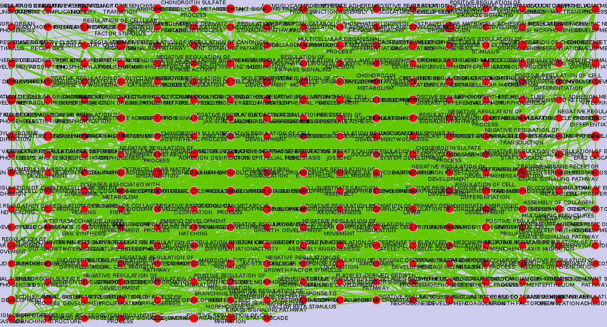

# To do:
missing the narrative for this vignette

# Purpose: 

* Recreating tutorials from [Bader lab] (http://www.baderlab.org/Software/EnrichmentMap/Tutorial) using Rcy3 and cytoscape.
* Create functions using RCy3 that make Enrichment Map easy to use in R. 


## Draft writing: Free writing that has not bee edited. Hidden from output for today.
### Enrichment Map
### Functional enrichment analysis
Many scientists use perform experiments to determine which biological pathways are enriched in certain diseases or conditions. Processed sequence data from RNAseq(ref) experiments from different treatments can be used  to visualize which pathways are present based on which genes ones are more enriched compared to the baseline. This informs which genes are important for regulating what is happening in the disease, what is causing the disease or the reaction of the organism to the disease state. Based on the  which genes are enriched, it can be determined which pathways are present in the specific state or treatment. 

These pathways are retrieved from databases that are curated from data  from many different experiments where the expression data have been measured **(is this true? where do the data from SEED come from). **
These pathways are important for looking at new experiments and can also be used in enviromental samples to examine the functional components of a community (see [Tara oceans vignette](Tara_oceans_vignette_here.html) for this use). 
Where I can use this pathway method applied to a metagenomic data set....see the curtis huttenhower lab for ideas and examples). 

The functional enrichment analysis is done outside of this vignette. Here we will use already processed data and we will use them to make a network in Cytoscape using the package RCy3.

## Reproducible Functional enrichment analysis
So twhere we come in is with [RCy3](https://github.com/tmuetze/Bioconductor_RCy3_the_new_RCytoscape), [Cytoscape](http://www.cytoscape.org/) and [EnrichmentMap](http://www.baderlab.org/Software/EnrichmentMap). The basic workflow is that you can use R scripts to build EnrichmentMaps that can be visualized and analysed in Cytoscape. The benefit of using R scripts is that it is easier to reproduce your analysis or even to repeat it with different data. 

## Install done?
-  To proceed please follow instructions in [installation vignette](Install_vignette.html) if you do not already have RCy3 and Cytoscape installed. 

RCy3 (stands for R to Cytoscape 3, there is also a RCy that was used with Cytoscape 2 see [here](https://www.bioconductor.org/packages/release/bioc/html/RCytoscape.html). The RCy3 package (actively developped by Tanja Muetze, Georgi Kolishovski, Paul Shannon) uses the [CyREST api](https://github.com/idekerlab/cyREST/wiki) to allow communication between R and Cytoscape. CyREST now comes with all installations of Cytoscape. It uses the API (application programming interface) from Cytoscape to send and receive information via R. This means that you can send data from R to Cytoscape and also receive information about the graphs that you have made in Cytoscape in R. This is useful for reproducibility, but also if you are analysing networks in ways that are not yet supported by plugins in Cytoscape. 

# GSEA processed data
So what we will do today is to use data already processed in Gene Set Enrichment Analysis (GSEA  which "determines whether an a priori defined set of genes shows statistically  significant, concordant differences between two biological states " ). 
 So this data is what?? 

We will do is use this processed data to make an Enrichment Map in Cytoscape and then manipulate the network stylistically to our preferences. 

### Load the appropriate libraries
```{r, message = FALSE}
library(RCy3)
library(httr)
library(RJSONIO)
```

## Important note:
* Make sure Cytoscape is open!


### Accessing the commands within Enrichment map?


## Enrichment map stuff

### For reference list of arguments for EnrichmentMap "build"
```help enrichmentmap build```
analysisType=<ListSingleSelection GSEA|generic|DAVID/BiNGO/Great)>: Analysis Type
classDataset1=<File>: Classes
classDataset2=<File>: Classes
coeffecients=<ListSingleSelection (OVERLAP|JACCARD|COMBINED)>: Similarity Coeffecient
enrichments2Dataset1=<File>: Enrichments 2
enrichments2Dataset2=<File>: Enrichments 2
enrichmentsDataset1=<File>: Enrichments
enrichmentsDataset2=<File>: Enrichments
expressionDataset1=<File>: Expression
expressionDataset2=<File>: Expression
gmtFile=<File>: GMT
phenotype1Dataset1=<String>: Phenotype1
phenotype1Dataset2=<String>: Phenotype1
phenotype2Dataset1=<String>: Phenotype2
phenotype2Dataset2=<String>: Phenotype2
pvalue=<Double>: P-value Cutoff
qvalue=<Double>: FDR Q-value Cutoff
ranksDataset1=<File>: Ranks
ranksDataset2=<File>: Ranks
similaritycutoff=<Double>: Similarity Cutoff

### For reference list of arguments for EnrichmentMap gseabuild
```help enrichmentmap gseabuild``` at Cytoscape command line
enrichmentmap gseabuild arguments:
combinedconstant=<Double>: combinedconstant
edbdir=<String>: edbdir
edbdir2=<String>: edbdir2
expressionfile=<String>: expressionfile
expressionfile2=<String>: expressionfile2
overlap=<Double>: overlap
pvalue=<Double>: P-value Cutoff
qvalue=<Double>: FDR Q-value Cutoff
similaritymetric=<ListSingleSelection (OVERLAP|JACCARD|COMBINED)>: similaritymetric

## Load functions for creating Enrichment map

```{r}
source("./functions_to_add_to_RCy3/working_with_EM.R")
```

```{r}
cy <- CytoscapeConnection ()
getEnrichmentMapCommandsNames(cy, "build")
getEnrichmentMapCommandsNames(cy, "gseabuild")
```


## Send data to the cytoscape network


 
Use data from the Bader lab tutorial
So first we read in the data.
Then we use the function X (as part of package ....y) to read in the enrichment data and set the parameters. 
```{r}
## Note: You cannot use relative paths in this,
## it needs to be the absolute path
path_to_file="/home/julia_g/windows_school/gsoc/EM-tutorials-docker/notebooks/data/"

enr_file = paste(path_to_file,
                 "gprofiler_results_mesenonly_ordered_computedinR.txt",
                 sep="")
```

If we wanted to see the full list of parameters we could run for this we could use `getEnrichmentMapCommandsNames(cy, "build")` and if we wanted to run functions for X types of analysis we could run `getEnrichmentMapCommandsNames(cy, "gseabuild")`. 


Set the parameters for use in the Em.
```{r}
em_params <- list(analysisType = "generic",
                  enrichmentsDataset1 = enr_file,
                  pvalue = "1.0",
                  qvalue = "0.00001",
                  #expressionDataset1 = exp_file, 
                  similaritycutoff = "0.25",
                  coeffecients = "JACCARD")
# Note there was a problem with the expressionDataset1 type files and it has been fixed in https://github.com/BaderLab/EnrichmentMapApp/issues/153 so when I update the Enrichment Map it should work. 


## No graph details is returned, just the connection to the graph
## so that it can be manipulated in Cytoscape via R. 
EM_1 <- setEnrichmentMapProperties(cy,
                                  "build",
                                  em_params)
```
These parameters could also be set in Cytoscape, but we are setting them here via script. The function that we run also attaches the window created in Cytoscape to our R session, so that we are able to manipulate the stylistic aspects of our network.

Is there a situation where using the last made window for this enrichment map will fail? What other option could I find?
## Save Enrichment map network

```{r}
saveImage(EM_1,
          "EM_1",
          "png",
          scale=4)
```


```{r}
print(noa.names(getGraph(EM_1)))

## test setting layout from R
layoutNetwork(EM_1,
                  'grid')

saveImage(EM_1,
          "EM_1_gridded",
          "png",
          scale=4)
```


```{r, cache = TRUE}
saveNetwork(EM_1, "EM_1")    
EM_1@graph

## if we want the graph data to be returned
## this part is slooooow!
EM_1_2 <- setEnrichmentMapProperties(cy,
                                   "build",
                                   em_params,
                                   copy.graph.to.R = TRUE)
print(noa.names(getGraph(EM_1_2)))

saveImage(EM_1_2,
          "EM_1_2",
          "png",
          scale=4)

```


## Following :
[Protocol 4 - Summarize Enrichment Results with Enrichment] Maps(https://github.com/BaderLab/EM-tutorials-docker/blob/master/notebooks/Protocol%204%20-%20Summarize%20Enrichment%20Results%20with%20Enrichment%20Maps.ipynb)

### Option 1: Load enrichment results from g:Profiler
```{r}
path_to_file="/home/julia_g/windows_school/gsoc/EM-tutorials-docker/notebooks/data/"

enr_file = paste0(path_to_file,
                 "gprofiler_results_mesenonly_ordered.txt")

expression_RNA_seq <- paste0(path_to_file,
                               "MesenchymalvsImmunoreactive_RNSseq_expression.txt")

ranks_file <- paste0(path_to_file,
                      "MesenchymalvsImmunoreactive_RNA_seq_ranks.rnk")
classes_file <- paste0(path_to_file,
                      "MesenchymalvsImmunoreactive_RNAseq_classes.cls")

# Phenotype - In the text boxes replace "UP" with "Mesenchymal" and "DOWN" with Immunoreactive. Mesenchymal will be associated with red nodes because it corresponds to the positive phenotype in the gprofiler_results_mesenonly_ordered.

em_params <- list(analysisType = "generic",
                  enrichmentsDataset1 = enr_file,
                  pvalue = "1.0",
                  qvalue = "0.0001",
                  #expressionDataset1 = expression_RNA_seq, 
                  #ranksDataset1 = ranks_file,
                  classDataset1 = classes_file,
                  phenotype1Dataset1 ="Mesenchymal",
                  phenotype2Dataset1 ="Immunoreactive",
                  similaritycutoff = "0.25",
                  coeffecients = "JACCARD")

EM_ex_4 <- setEnrichmentMapProperties(cy,
                                  "build",
                                  em_params)

```


```{r}
saveImage(EM_ex_4,
          "EM_ex_4",
          "png",
          scale=4)
```


### Option 2: Load enrichment results from GSEA

```{r}

path_to_file="/home/julia_g/windows_school/gsoc/EM-tutorials-docker/notebooks/data/"

gmt_file = paste0(path_to_file,
                 "Human_GOBP_AllPathways_no_GO_iea_December_24_2015_symbol.gmt")
expression_file <- paste0(path_to_file,
                          "MesenchymalvsImmunoreactive_RNSseq_expression.txt")
## come back here! was running
# enrichments_1 <- paste0(path_to_file,
#                         )
# 
# Enrichments 1- gsea_home/output/[data]/ Mesen_vs_Immuno_edgeR.GseaPreranked.1453221178549 / gsea_report_for_na_pos_1453221178549.xls (example file name. Number is automatically generated and will be different for results run by user.
# Enrichments 2 – gsea_home/output/[data]/ Mesen_vs_Immuno_edgeR.GseaPreranked.1453221178549 /gsea_report_for_na_neg_1453221178549.xls (example file name. Number is automatically generated and will be different for results run by user.
# Classes - MesenchymalvsImmunoreactive_RNAseq_classes.cls


```


## Recreate tutorial on lab website: http://www.baderlab.org/Software/EnrichmentMap/Tutorial

```{r}

gsea_tut_path="/home/julia_g/windows_school/gsoc/gsoc_Rcy3_vignettes/GSEATutorial/"

gmt_file <- paste0(gsea_tut_path,
                   "Human_GO_AllPathways_no_GO_iea_April_15_2013_symbol.gmt")

data_1_ex_1 <- paste0(gsea_tut_path,
                     "MCF7_ExprMx_v2_names.gct")

gsea_tut_path="/home/julia_g/gsea_home/output/may23/estrogen_treatment_12hr_gsea_enrichment_results.Gsea.1464036337021/"

data_1_en_1_es <- paste0(gsea_tut_path,
                      "gsea_report_for_ES12_1464036337021.xls")
data_1_en_2_nt <- paste0(gsea_tut_path,
                         "gsea_report_for_NT12_1464036337021.xls")

rank_file <- paste0(gsea_tut_path,
                    "edb/MCF7_ExprMx_v2_names_ExprMx_v2_names.ES_NT.cls_ES12_versus_NT12.rnk")


#Dataset 1 / Phenotypes 1: ES12 VS NT12 (OPTIONAL)

em_params <- list(analysisType = "GSEA",
                  gmtFile = gmt_file,
                  expressionDataset1 = data_1_ex_1,
                  enrichmentsDataset1 = data_1_en_1_es,
                  enrichments2Dataset1 = data_1_en_2_nt,
                  pvalue = "0.001",
                  qvalue = "0.05",
                  ranksDataset1 = rank_file,
                  phenotype1Dataset1 ="ES12",
                  phenotype2Dataset1 ="NT12",
                  similaritycutoff = "0.25",
                  coeffecients = "JACCARD")

EM_ex_6 <- setEnrichmentMapProperties(cy,
                                  "build",
                                  em_params)
```


Successfully built!
```{r}
saveImage(EM_ex_6,
          "EM_ex_6",
          "png",
          scale=4)
```


## Next steps

- Verify that I have made these functions correctly for use in S4 framework
- Clean up the use of the functions
- command to print list of setable properties?

## Helpful references:

### Reference for the API

found this page which is helpful for the api:
http://idekerlab.github.io/cyREST/#1637304040

### Finding command names available in Cytoscape using R

Finally found: 

http://localhost:1234/v1/commands

Which gives the same as when you type `help` in the Command Line Dialog in cytoscape
