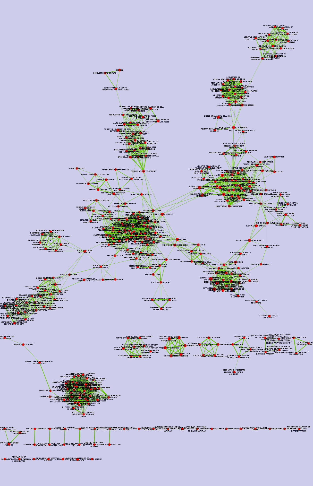

# Purpose: 

* Recreating tutorials from [Bader lab](http://www.baderlab.org/Software/EnrichmentMap/Tutorial) using Rcy3 and cytoscape.
* Create and test out functions using RCy3 that make Enrichment Map easy to use in R. 

# Enrichment Map
## Functional enrichment analysis

Many scientists use perform experiments to determine which biological pathways are expressed more in certain diseases or conditions. From processed sequence data from RNAseq experiments from different treatments and/or samples the genes ones that are more or less enriched compared to the baseline can be visualized. This informs which genes are important for regulating processes related to the disease or disease state. Visualizing which genes are statistically more highly expressed under certain conditions can be helpful for interpretation and further analysis of the data. Based on which genes are enriched, it can also be determined which pathways are present in the specific state or treatment. 


The functional enrichment analysis is done outside of this vignette. Here we will use already processed data and we will use them to make a network in Cytoscape using the package RCy3.

## Reproducible Functional enrichment analysis
The basic workflow is that you can use R scripts with [RCy3](https://github.com/tmuetze/Bioconductor_RCy3_the_new_RCytoscape) to build [EnrichmentMaps](http://www.baderlab.org/Software/EnrichmentMap) that can be visualized and analysed in [Cytoscape](http://www.cytoscape.org/). The benefit of using R scripts is that it is easier to reproduce your analysis or to repeat it with different data. 

# Install done?
-  To proceed please follow instructions in [installation vignette](Install_vignette.html) if you do not already have RCy3 and Cytoscape installed. 

RCy3 (stands for R to Cytoscape 3, there is also a RCy that was used with Cytoscape 2 see [here](https://www.bioconductor.org/packages/release/bioc/html/RCytoscape.html). The RCy3 package (actively developed by Tanja Muetze, Georgi Kolishovski, Paul Shannon) uses the [CyREST api](https://github.com/idekerlab/cyREST/wiki) to allow communication between R and Cytoscape. CyREST now comes with all installations of Cytoscape. It uses the API (application programming interface) from Cytoscape to send and receive information from R. This means that we can send data from R to Cytoscape and also receive information about the graphs that you have made in Cytoscape in R. This is useful for reproducibility, but also if you are analysing networks in ways that are not yet supported by plugins in Cytoscape. 

# GSEA processed data
So what we will do today is to use data already processed in Gene Set Enrichment Analysis (GSEA which "determines whether an *a priori* defined set of genes shows statistically  significant, concordant differences between two biological states"). 

We will use this processed data to make an Enrichment Map in Cytoscape from R. 

## Load the appropriate libraries
```{r, message = FALSE}
library(RCy3)
library(httr)
library(RJSONIO)
```

## Important note:
* Make sure Cytoscape is open before running the code below!

## Load functions for creating Enrichment map

```{r}
source("./functions_to_add_to_RCy3/working_with_EM.R")
```

Create the connection to Cytoscape
```{r}
cy <- CytoscapeConnection ()
```

Examine the commands that are available in Enrichment Map.
```{r}
getEnrichmentMapCommandsNames(cy, "build")
getEnrichmentMapCommandsNames(cy, "gseabuild")
```

## Files that can be used

See the Bader lab website for full explanation:<https://github.com/BaderLab/EnrichmentMapApp/blob/EM_Cyto3_port/EnrichmentMapPlugin/doc/EM_wiki_manual.txt>

- **"gmtFile"**:  Tab-separated file where the header has name, description and samples and each row is one gene in the geneset.
- **"analysisType"** Analysis type can be "generic", "GSEA", or "DAVID/BiNGO/Great""
- **"classDataset1"** Classes (optional) for dataset1
- **"classDataset2"** Classes (optional) for dataset2 
- **"coeffecients"** Similarity Coefficient type (typo in name, but you must type it that way). Can be "OVERLAP","JACCARD", or "COMBINED" (both OVERLAP and JACCARD)
- **"similaritycutoff"** Similarity Cutoff for the coefficient chosen, 0.0 is least similar and 1.0 is most similar. 
- **"enrichments2Dataset1"** Tab-separated File containing gene names and their p-values from enrichment condition 2 from dataset 1
- **"enrichments2Dataset2"** Tab-separated File containing gene names and their p-values from enrichment condition 2 from dataset 2
-  **"enrichmentsDataset1"** Tab-separated File containing gene names and their p-values from enrichment condition 1 from dataset 1 
-  **"enrichmentsDataset2"** Tab-separated File containing gene names and their p-values from enrichment condition 1 from dataset 2
- **"expressionDataset1"** Expression (optional) tab-separated file containing gene name, description and expression values. For dataset1
- **"expressionDataset2"** Expression (optional) tab-separated file containing gene name, description and expression values. For dataset2
- **"phenotype1Dataset1"** Default is "Up" for Phenotype1. Can change to a descriptive word for enrichment 1 
- **"phenotype2Dataset1"** Default is "Down" for Phenotype2. Can change to a descriptive word for enrichment 2 
- **"phenotype1Dataset2"**  same as above but for Dataset2
- **"phenotype2Dataset2"** same as above but for Dataset2
- **"pvalue"** P-value Cutoff for enrichment data to be used.       
- **"qvalue"** False discovery rate (Q-value) cutoff. Used with multiple comparisons. 
- **"ranksDataset1"** Ranks (optional) tab-separated file containing genes and their rank (from GSEA) for Dataset1
-  **"ranksDataset2"** Ranks (optional) tab-separated file containing genes and their rank (from GSEA) for Dataset2

## Send data to the cytoscape network

So first we read in the data from the supplied files and set the parameters.

**Note on file paths**: 
You cannot use relative paths with EnrichmentMap from R. The filenames need to be given as their absolute paths.

```{r}
path_to_file <- "/home/julia_g/windows_school/gsoc/EM-tutorials-docker/notebooks/data/"

enr_file <- paste0(path_to_file,
                   "gprofiler_results_mesenonly_ordered_computedinR.txt")
exp_file <- paste0(path_to_file,
                   "MesenchymalvsImmunoreactive_expression.txt")
```

If we wanted to see the full list of parameters available, we could use `getEnrichmentMapCommandsNames(cy, "build")` and if we wanted to run functions for GSEA types of analysis we could run `getEnrichmentMapCommandsNames(cy, "gseabuild")`. 

## Set the parameters for use in the Enrichment Map.
```{r}
em_params <- list(analysisType = "generic",
                  enrichmentsDataset1 = enr_file,
                  pvalue = "1.0",
                  qvalue = "0.00001",
                  expressionDataset1 = exp_file, 
                  similaritycutoff = "0.25",
                  coeffecients = "JACCARD")
```

No graph details are returned, this is just setting the parameters that will be sent to Cytoscape via RCy3. 

Now build the enrichment map
```{r}
EM_1 <- setEnrichmentMapProperties(cy,
                                   "build",
                                   em_params)
```

These parameters can also be set in Cytoscape, but we are setting them here via script. The function that we run also attaches the window created in Cytoscape to our R session, so that we are able to manipulate the stylistic aspects of our network by using "EM_1".

## Save Enrichment map network image

```{r}
saveImage(EM_1,
          "EM_1",
          "png",
          scale=4)
```


## Change the layout of the network

Can change any of the visual properties of "EM_1" now. For demonstration let's change the layout. 
```{r}
layoutNetwork(EM_1,
              'kamada-kawai')

## save network visualization
saveImage(EM_1,
          "EM_1_kamada-kawai",
          "png",
          scale=4)
```


We can also save our network file to use at a later date or to send to collaborators.

```{r, cache = TRUE}
saveNetwork(EM_1, "EM_1") ## Creates "EM_1.cys" which can be reopened in Cytoscape
```

In our R session we are connected to the graph in Cytoscape and can manipulate the graph's visual properties, but we do not have the graph information in R. 

```{r}
EM_1@graph
```

If we want the graph pulled in to R then we can set the argument "copy.graph.to.R" to ```TRUE``` in `setEnrichmentMapProperties()`. This redoes our EM analysis in Cytoscape and stores it as EM_1_2.  

```{r, cache = TRUE}
EM_1_2 <- setEnrichmentMapProperties(cy,
                                     "build",
                                     em_params,
                                     copy.graph.to.R = TRUE)
```

Now if we have a look at the graph part of the stored object we will see we have retrieved the information from the graph. 
```{r}
EM_1_2@graph
print(noa.names(getGraph(EM_1_2))) # retrieves node attributes from the graph

saveImage(EM_1_2,
          "EM_1_2",
          "png",
          scale=4)
```


# Summarizing Enrichment Results with Enrichment Maps

WHAT IS THE PURPOSE HERE??

## Following:
[Protocol 4 - Summarize Enrichment Results with Enrichment Maps](https://github.com/BaderLab/EM-tutorials-docker/blob/master/notebooks/Protocol%204%20-%20Summarize%20Enrichment%20Results%20with%20Enrichment%20Maps.ipynb)

### Option 1: Load enrichment results from g:Profiler

Load in the datafiles
```{r}
path_to_file <- "/home/julia_g/windows_school/gsoc/EM-tutorials-docker/notebooks/data/"

enr_file <-  paste0(path_to_file,
                    "gprofiler_results_mesenonly_ordered.txt")

exp_file <- paste0(path_to_file,
                   "MesenchymalvsImmunoreactive_expression.txt") # this one works. 
#expression_RNA_seq <- paste0(path_to_file,
#                             "MesenchymalvsImmunoreactive_RNSseq_expression_ed.txt") ## not working
# ranks_file <- paste0(path_to_file,
#                      "MesenchymalvsImmunoreactive_RNA_seq_ranks.rnk") ## does not work
ranks_file <- paste0(path_to_file,
                     "MesenchymalvsImmunoreactive_edger_ranks.rnk")

classes_file <- paste0(path_to_file,
                       "MesenchymalvsImmunoreactive_RNAseq_classes.cls")
```

```{r}
em_params <- list(analysisType = "generic",
                  enrichmentsDataset1 = enr_file,
                  pvalue = "1.0",
                  qvalue = "0.0001",
                  expressionDataset1 = exp_file, 
                  ranksDataset1 = ranks_file, ## not working from RNA seq data
                  classDataset1 = classes_file,
                  phenotype1Dataset1 = "Mesenchymal", # shows up as positive, red, nodes. 
                  phenotype2Dataset1 = "Immunoreactive",
                  similaritycutoff = "0.25",
                  coeffecients = "JACCARD")

EM_ex_4 <- setEnrichmentMapProperties(cy,
                                      "build",
                                      em_params)
```


```{r}
saveImage(EM_ex_4,
          "EM_ex_4",
          "png",
          scale=4)
```



### Option 2: Load enrichment results from GSEA

```{r}
path_to_file <- "/home/julia_g/windows_school/gsoc/EM-tutorials-docker/notebooks/data/"

gmt_file <-  paste0(path_to_file,
                    "Human_GOBP_AllPathways_no_GO_iea_December_24_2015_symbol.gmt")
expression_file <- paste0(path_to_file,
                          "MesenchymalvsImmunoreactive_expression.txt") ## changed from RNA seq one
enrichments_1 <- paste0(path_to_file,
                        "testing_out_GSEA.GseaPreranked.1466070031657/gsea_report_for_na_pos_1466070031657.xls")
enrichments_2 <- paste0(path_to_file,
                        "testing_out_GSEA.GseaPreranked.1466070031657/gsea_report_for_na_neg_1466070031657.xls")
ranks_file <- paste0(path_to_file,
                     "MesenchymalvsImmunoreactive_RNAseq_ranks.rnk")
classes_file <- paste0(path_to_file,
                       "MesenchymalvsImmunoreactive_RNAseq_classes.cls")
```

Not working!
```{r}
# Note on Phenotype - In the text boxes replace "UP" with "Mesenchymal" and "DOWN" with "Immunoreactive". Mesenchymal will be associated with red nodes because it corresponds to the positive phenotype in the gprofiler_results_mesenonly_ordered.

## don't think these are available with GSEA. :()
# em_params <- list(analysisType = "GSEA",
#                  #gmtFile = gmt_file,
#                   pvalue = "1.0",
#                   qvalue = "0.0001",
#                   #expressionDataset1 = expression_file,
#                   #ranksDataset1 = ranks_file,
#                   #classDataset1 = classes_file,
#                   enrichmentsDataset1 = enrichments_1,
#                   enrichments2Dataset1 = enrichments_2,
#                   phenotype1Dataset1 ="Mesenchymal",
#                   phenotype2Dataset1 ="Immunoreactive",
#                   similaritycutoff = "0.25",
#                   coeffecients = "JACCARD")
# # 
# EM_ex_5 <- setEnrichmentMapProperties(cy,
#                                       "build",
#                                       em_params)

```


```{r}
# saveImage(EM_ex_5,
#           "EM_ex_5",
#           "png",
#           scale=4)
```

[](./EM_ex_5.png)


# Recreate tutorial from lab website: http://www.baderlab.org/Software/EnrichmentMap/Tutorial

What is purpose??

```{r}

gsea_tut_path <- "/home/julia_g/windows_school/gsoc/gsoc_Rcy3_vignettes/GSEATutorial/"

gmt_file <- paste0(gsea_tut_path,
                   "Human_GO_AllPathways_no_GO_iea_April_15_2013_symbol.gmt")

data_1_ex_1 <- paste0(gsea_tut_path,
                      "MCF7_ExprMx_v2_names.gct")

gsea_tut_path="/home/julia_g/gsea_home/output/may23/estrogen_treatment_12hr_gsea_enrichment_results.Gsea.1464036337021/"

data_1_en_1_es <- paste0(gsea_tut_path,
                         "gsea_report_for_ES12_1464036337021.xls")
data_1_en_2_nt <- paste0(gsea_tut_path,
                         "gsea_report_for_NT12_1464036337021.xls")

rank_file <- paste0(gsea_tut_path,
                    "edb/MCF7_ExprMx_v2_names_ExprMx_v2_names.ES_NT.cls_ES12_versus_NT12.rnk")
```


```{r}
#Dataset 1 / Phenotypes 1: ES12 VS NT12 

em_params <- list(analysisType = "GSEA",
                  gmtFile = gmt_file,
                  expressionDataset1 = data_1_ex_1,
                  enrichmentsDataset1 = data_1_en_1_es,
                  enrichments2Dataset1 = data_1_en_2_nt,
                  pvalue = "0.001",
                  qvalue = "0.05",
                  ranksDataset1 = rank_file,
                  phenotype1Dataset1 ="ES12",
                  phenotype2Dataset1 ="NT12",
                  similaritycutoff = "0.25",
                  coeffecients = "JACCARD")

EM_ex_6 <- setEnrichmentMapProperties(cy,
                                      "build",
                                      em_params)
```


Successfully built!

We are examining Estrogen treatment vs no treatment at 12hr
```{r}
saveImage(EM_ex_6,
          "EM_ex_6",
          "png",
          scale=4)
```


## Helpful references:

### Reference for the API

found this page which is helpful for the cyREST api:
http://idekerlab.github.io/cyREST/#1637304040
