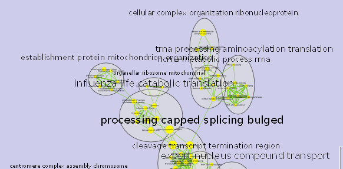
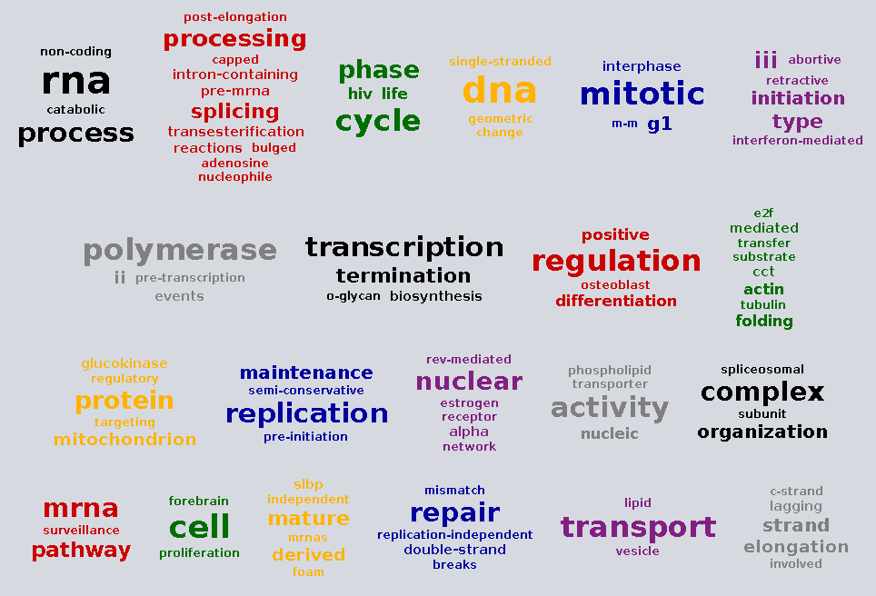

# Recreate tutorial from lab website and attempt to work with autoannotate and wordcloud: http://www.baderlab.org/Software/EnrichmentMap/Tutorial

- not currently fully functional because of problems with running autoannotate and wordcloud via cyREST. 

## Load the appropriate libraries

```{r, message = FALSE}
library(RCy3)
library(httr)
library(RJSONIO)
```

## Important note:

* Make sure Cytoscape is open before running the code below!

## Load functions for creating Enrichment map

```{r, cache = TRUE}
source("./functions_to_add_to_RCy3/working_with_EM.R")
```

Create the connection to Cytoscape

```{r, cache = TRUE}
# first, delete existing windows to save memory:
deleteAllWindows(CytoscapeConnection())
cy <- CytoscapeConnection ()
```

```{r, cache = TRUE}
gsea_tut_path <- "/home/julia_g/windows_school/gsoc/gsoc_Rcy3_vignettes/GSEATutorial/"

gmt_file <- paste0(gsea_tut_path,
                   "Human_GO_AllPathways_no_GO_iea_April_15_2013_symbol.gmt")

data_1_ex_1 <- paste0(gsea_tut_path,
                      "MCF7_ExprMx_v2_names.gct")

gsea_tut_path <- "/home/julia_g/gsea_home/output/may23/estrogen_treatment_12hr_gsea_enrichment_results.Gsea.1464036337021/"

data_1_en_1_es <- paste0(gsea_tut_path,
                         "gsea_report_for_ES12_1464036337021.xls")
data_1_en_2_nt <- paste0(gsea_tut_path,
                         "gsea_report_for_NT12_1464036337021.xls")

rank_file <- paste0(gsea_tut_path,
                    "edb/MCF7_ExprMx_v2_names_ExprMx_v2_names.ES_NT.cls_ES12_versus_NT12.rnk")
```

```{r, cache = TRUE}
#Dataset 1 / Phenotypes 1: ES12 VS NT12 

em_params <- list(analysisType = "GSEA",
                  gmtFile = gmt_file,
                  expressionDataset1 = data_1_ex_1,
                  enrichmentsDataset1 = data_1_en_1_es,
                  enrichments2Dataset1 = data_1_en_2_nt,
                  pvalue = "0.001",
                  qvalue = "0.05",
                  ranksDataset1 = rank_file,
                  phenotype1Dataset1 ="ES12",
                  phenotype2Dataset1 ="NT12",
                  similaritycutoff = "0.25",
                  coeffecients = "JACCARD")

EM_ex_6 <- setEnrichmentMapProperties(cy,
                                      "build",
                                      em_params,
                                      copy.graph.to.R = TRUE)
```

Successfully built!
The experiment concerns ??? and we are examining estrogen treatment vs no treatment at 12hr. 

```{r, cache = TRUE}
fitContent(EM_ex_6)
Sys.sleep(10)
saveImage(EM_ex_6,
          "EM_ex_6",
          "png",
          h = 2000)
```


# Use the application auto annotate to add better labels to the groups in Enrichment Map

```{r, cache = TRUE}
source("./functions_to_add_to_RCy3/working_with_auto_annotate.R")

## autoannotate label-clusterBoosted  
# Run label algorithm 'clusterBoosted'. Uses WordCloud to calculate the labels. Words in the label are the most frequent words and their adjacent words. The higher the "adjacent word bonus" is, the more likely adjacent words will be in the label.

# autoannotate label-sizeSorted  Run label algorithm 'sizeSorted'. Uses WordCloud to calculate the labels. Words in the label are the most frequent words.

#autoannotate label-clusterBoosted arguments:
#adjacentWordBonus=: Size bonus given to words that are adjacent to the largest words. Default: 8
#labelColumn=: Name of node column to use to generate the labels
#maxWords=: Max words to include in label. Default: 4
#nodeList=[nodeColumn:value|node name,...]|all|selected|unselected: List of nodes in the cluster

```

```{r, cache = TRUE}
getAutoAnnotateCommandsNames(cy,
                             "label-clusterBoosted")
getAutoAnnotateCommandsNames(cy,
                             "label-sizeSorted")
```

** The app via cyrest does not add the annotations, but identifies the clusters, so not currently working to add in the labels. 


```{r}
## problems here with the column label, 
## need to generate it from the network to be queried.
## make sure to select the appropriate network. 
autoa_params <- list(adjacentWordBonus = 8,   # int
                     labelColumn = "EM3_GS_DESCR", # string
                     maxWords = 30,        # int
                     nodeList = "all"
)   # list nodes in the cluster

EM_ex_7 <- setAutoAnnotateProperties(EM_ex_6,
                                      "label-clusterBoosted",
                                      autoa_params)
```

**not working**

If it were working I would expect to see results something like this:


# Test out word cloud

wordcloud create arguments:
cloudName=<String>: Cloud name ----
create=true|false: Actually create the cloud or just return the results without creating the cloud.
nodeList=[nodeColumn:value|node name,...]|all|selected|unselected: List of Nodes
wordColumnName=<String>: Column with words

```{r, cache = TRUE}
wordcloud_params <- list(cloudName = "Test_cloud_from_R",  
                     create = TRUE,
                     nodeList = "all",
                     wordColumnName = "EM3_GS_DESCR")

request.uri <- "http://localhost:1234/v1/commands/wordcloud/create"
request.res <- GET(url = request.uri,
                   query = wordcloud_params)
request.res

## currently have to manually save. would like an export function like in the GUI.
```

If it worked it would look something like this:



