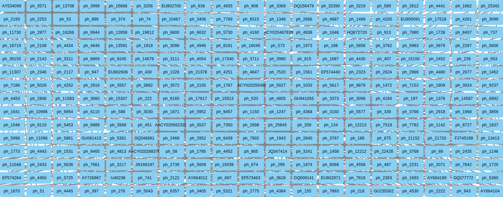
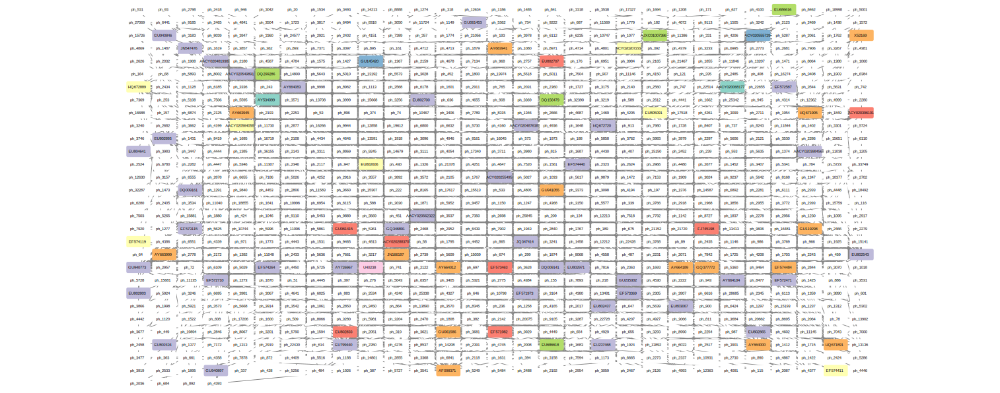
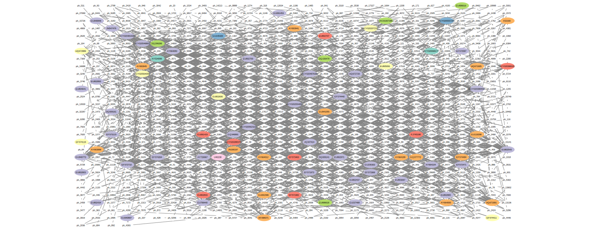
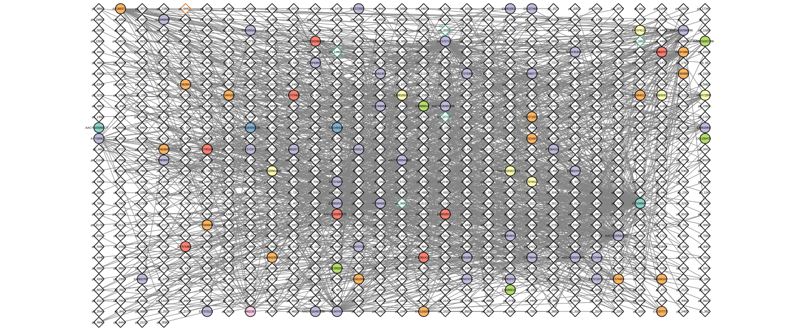
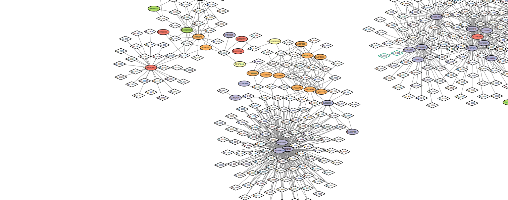
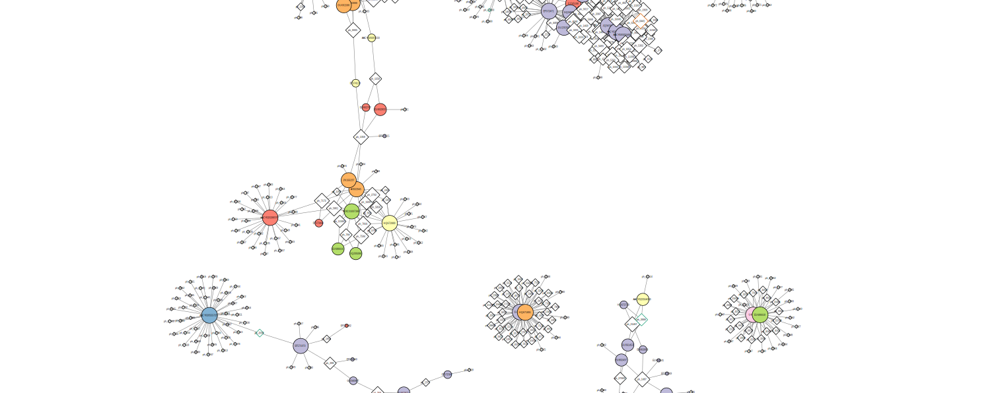
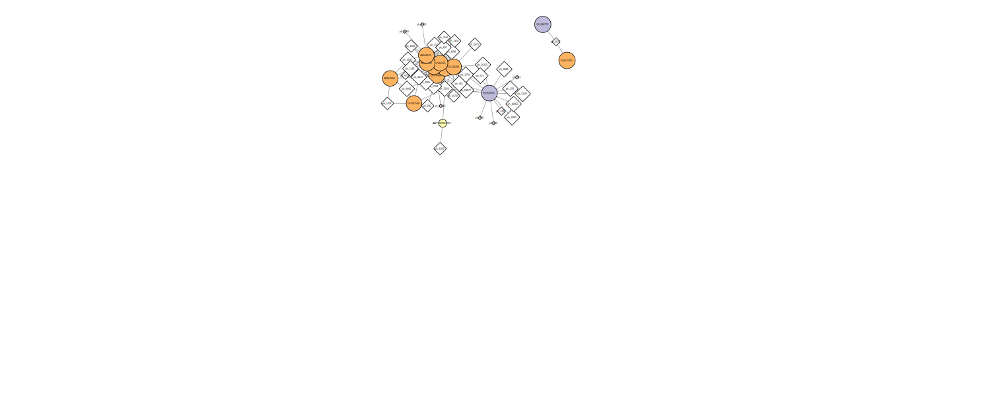

# Visualizing a co-occurence network in Cytoscape
Julia Gustavsen  

# Description of vignette

## Tara Oceans

There have been many projects where samples have been collected from different parts of the ocean. Some, such as the pioneering study by Craig Venter[@venter_environmental_2004] have pioneered metagenomic sequencing and others  have collected large amounts of data with global ecological questions in mind.

In the [Tara Oceans Expedition](http://oceans.taraexpeditions.org/) the researchers outfitted a small sailboat with a lab and filtration supplies. On the Tara Oceans ([8th and 9th expedition for this vessel ](http://oceans.taraexpeditions.org/en/m/about-tara/les-expeditions/tara-oceans/) scientists collected samples from many different size fractions of microorganisms in the oceans over three years. They collected these samples to look at the different kinds of microorganisms present in different parts of the oceans and to observe the spatial patterns and distribution of these microorganisms. 

The scientists collected the samples and then either used targeted sequencing (amplicon approach using primers for specific targets such as the ribosomal genes and then amplifying these targets using PCR) or using metagenomic sequencing (where all of the  genetic material in a sample is sequenced) of each of the size fractions.

After the sequencing and quality checking of the samples was done the sequences were classified (different approaches for the different targets, see here for the details in @brum_patterns_2015 and @sunagawa_structure_2015). After that the data could be made into a species occurrence table where you have rows of the different sites and then columns are the observations of the different organisms found at each site [@lima-mendez_determinants_2015].

## What is co-occurence data?

Many of these microbial species in these types of studies have not yet been characterized in the lab. Thus to know more about the organisms and their interactions, we can observe which ones occur at the same sites or under the same kinds of environmental conditions. One way to do that is by using co-occurrence networks where it is examined which organisms occur together at which sites. The more frequently that organisms occur at the same site the stronger the interaction you predict among these organisms. For a review of some of the different kinds of techniques and software for creating interaction networks please see: @weiss_correlation_2016.

## What can we find out by creating co-occurence networks?

These kinds of analyses can be useful for data where the organisms have not yet been characterized in the lab because they can provide insights about the communities and how the organisms are interacting within them. These analyses can be exploratory so that we can see which organisms warrant further insights and perhaps experiments. We can also learn about the overall community structure by looking at some of the network properties.

## What kind of data are used in this vignette?

In this dataset we have data that have come from the bacterial dataset [@sunagawa_structure_2015]  and and also from the viral dataset [@brum_patterns_2015]. They have been examined in @lima-mendez_determinants_2015 and we have used the original relative abundances to visualize the data. Data were retrieved from: http://www.raeslab.org/companion/ocean-interactome.html

# Set up Cytoscape and R connection

We will run this example using RCy3 [@shannon_rcytoscape:_2013] to drive the visualization of these networks in Cytoscape[@shannon_cytoscape:_2003] using CyREST[@ono_cyrest:_2015].

## Requirements

```r
library(RCy3)
library(igraph)
library(RJSONIO)
library(RColorBrewer)
library(httr)
```
To run this example **Cytoscape software must be running**. If you are having problems installing please see [here](installing_software.html). In Cytoscape we will also need Allegro-plugin for this example. 

To begin we create a connection in R that we can use to manipulate the networks and then we will delete any windows that were already in Cytoscape so that we don't use up all of our memory. 

```r
cy <- CytoscapeConnection()
deleteAllWindows(cy)
```

# Read in data

We will read in a species co-occurrence matrix that was calculated using Spearman Rank coefficient. (If interested in seeing how this was done please see scripts and the raw data in inst/data-raw)


```r
## scripts for processing in "inst/data-raw/"
prok_vir_cor <- read.delim("./data/virus_prok_cor_abundant.tsv")
```

There are many different ways to work with graphs in R. We will use both the igraph [@csardi_igraph_2006] and the graph [@gentleman_graph:_2016] package to work with our network with Cytoscape.

The igraph package is used to convert the co-occurrence dataframe into a network that we can send to Cytoscape. In this case our graph is undirected (so "directed = FALSE") since we do not have any information about the direction of the interactions. 

```r
graph_vir_prok <- simplify(graph.data.frame(prok_vir_cor,
                                            directed = FALSE))
```

# Read in taxonomic classification

Since these are data from small, microscopic organisms that were sequenced using shotgun sequencing we rely on the classification of the sequences to know what kind of organisms are in the samples. In this case the bacterial viruses (bacteriophage), were classified by Basic Local Alignment Search Tool (BLAST http://blast.ncbi.nlm.nih.gov/Blast.cgi) by searching for their closest resembling sequence in the RefSeq database (see methods here [@brum_patterns_2015]). The prokaryotic taxonomic classifications were determined using the [SILVA database](https://www.arb-silva.de/).


```r
phage_id_affiliation <- read.delim("./data/phage_ids_with_affiliation.tsv")
bac_id_affi <- read.delim("./data/prok_tax_from_silva.tsv")
```

# Add the taxonomic classifications to the network and then send network to Cytoscape

In preparation for sending the networks to Cytoscape we will add in the taxonomic data. Some of the organisms do not have taxonomic classifications associated with them so we have described them as "not_class" for not classified.


```r
genenet.nodes <- as.data.frame(vertex.attributes(graph_vir_prok))

## not all have classification, so create empty columns
## before had NA but was worried it was messing up the setting of attributes.
genenet.nodes$phage_aff <- rep("not_class", nrow(genenet.nodes))
genenet.nodes$Tax_order <- rep("not_class", nrow(genenet.nodes))
genenet.nodes$Tax_subfamily <- rep("not_class", nrow(genenet.nodes))

for (row in seq_along(1:nrow(genenet.nodes))){
  if (genenet.nodes$name[row] %in% phage_id_affiliation$first_sheet.Phage_id_network){
    id_name <- as.character(genenet.nodes$name[row])
    aff_to_add <- unique(subset(phage_id_affiliation,
                                first_sheet.Phage_id_network == id_name,
                                select = c(phage_affiliation,
                                           Tax_order,
                                           Tax_subfamily)))
    genenet.nodes$phage_aff[row] <- as.character(aff_to_add$phage_affiliation)
    genenet.nodes$Tax_order[row] <- as.character(aff_to_add$Tax_order)
    genenet.nodes$Tax_subfamily[row] <- as.character(aff_to_add$Tax_subfamily)
  }
}
```


```r
## do the same for proks
genenet.nodes$prok_king <- rep("not_class", nrow(genenet.nodes))
genenet.nodes$prok_tax_phylum <- rep("not_class", nrow(genenet.nodes))
genenet.nodes$prok_tax_class <- rep("not_class", nrow(genenet.nodes))

for (row in seq_along(1:nrow(genenet.nodes))){
  if (genenet.nodes$name[row] %in% bac_id_affi$Accession_ID){
    aff_to_add <- unique(subset(bac_id_affi,
                                Accession_ID == as.character(genenet.nodes$name[row]),
                                select = c(Kingdom,
                                           Phylum,
                                           Class)))
    
    genenet.nodes$prok_king[row] <- as.character(aff_to_add$Kingdom)
    genenet.nodes$prok_tax_phylum[row] <- as.character(aff_to_add$Phylum)
    genenet.nodes$prok_tax_class[row] <- as.character(aff_to_add$Class)
  }
}
```


Pull in the edge data and then prepare to send the nodes and edges to Cytoscape using the function `cyPlot()`.

```r
genenet.edges <- data.frame(as_edgelist(graph_vir_prok))
names(genenet.edges) <- c("name.1",
                          "name.2")
genenet.edges$Weight <- edge_attr(graph_vir_prok)[[1]]

genenet.edges$name.1 <- as.character(genenet.edges$name.1)
genenet.edges$name.2 <- as.character(genenet.edges$name.2)
genenet.nodes$name <- as.character(genenet.nodes$name)

ug <- cyPlot(genenet.nodes,genenet.edges)
```


# Send network to Cytoscape using RCy3

Now we will send the network from R to Cytoscape.

```r
cw <- CytoscapeWindow("Tara oceans",
                      graph = ug,
                      overwriteWindow = TRUE)
```


```r
displayGraph(cw)
layoutNetwork(cw)
```

<!-- -->

# Colour network by prokaryotic phylum

We would like to get an overview of the different phylum of bacteria that are in the network. One way  is to colour the different nodes based on their phylum classification. The package Rcolorbrewer will be used to generate a set of good colours for the nodes. 


```r
families_to_colour <- unique(genenet.nodes$prok_tax_phylum)
families_to_colour <- families_to_colour[!families_to_colour %in% "not_class"]
node.colour <- brewer.pal(length(families_to_colour),
                          "Set3")
setNodeColorRule(cw,
                 'prok_tax_phylum',
                 families_to_colour,
                 node.colour,
                 "lookup",
                 default.color='#ffffff')
```

```
## Successfully set rule.
```


```r
displayGraph(cw)
```

<!-- -->

## Set node shape to reflect virus or prokaryote

Next we would like to change the shape of the node to reflect whether the nodes are viral or prokaryotic in origin. In this dataset all of the viral node names start with "ph_", thus we can set the viral nodes to be diamond-shaped by looking for all the nodes that start with "ph" in the network. 

```r
shapes_for_nodes <- c('DIAMOND')

phage_names <- grep("ph_",
                    genenet.nodes$name,
                    value = TRUE)
setNodeShapeRule(cw,
                 "label",
                 phage_names,
                 shapes_for_nodes)
```

```
## Successfully set rule.
```


```r
displayGraph(cw)
```

<!-- -->

# Colour edges of phage nodes

The classification of the viral data was done in a very conservative manner so not a lot of the viral nodes were classified. However, if we do want to add some of this information  to our visualization we can colour the edges of the viral nodes by family. The main families that were identified in this dataset are the *Podoviridae*, the *Siphoviridae* and the *Myoviridae* (for more info see [NCBI Podoviridae](http://www.ncbi.nlm.nih.gov/Taxonomy/Browser/wwwtax.cgi?mode=Info&id=10744&lvl=3&p=7&lin=f&keep=1&srchmode=1&unlock), [NCBI Myoviridae](http://www.ncbi.nlm.nih.gov/Taxonomy/Browser/wwwtax.cgi?mode=Tree&id=10662&lvl=3&p=7&lin=f&keep=1&srchmode=1&unlock), and [NCBI Siphoviridae](http://www.ncbi.nlm.nih.gov/Taxonomy/Browser/wwwtax.cgi?mode=Tree&id=10699&lvl=3&p=7&lin=f&keep=1&srchmode=1&unlock))


```r
setDefaultNodeBorderWidth (cw, 5)
families_to_colour <- c(" Podoviridae",
                        " Siphoviridae",
                        " Myoviridae")
node.colour <- brewer.pal(length(families_to_colour),
                          "Dark2")
setNodeBorderColorRule(cw,
                       'Tax_subfamily',
                       families_to_colour,
                       node.colour,
                       "lookup", 
                       default.color = "#000000")
```

```
## Successfully set rule.
```


```r
displayGraph(cw)
```

<!-- -->

# Do layout to minimize overlap of nodes. 

After doing all of this colouring to the network we would like to layout the network in a way that allows us to more easily see which nodes are connected without overlap. To do the layout we will use the [Cytoscape plugin Allegro](http://apps.cytoscape.org/apps/allegrolayout). 

Using RCy3 to drive Cytoscape, if we are not sure what the current values are for a layout or we are not sure what kinds of values are accepted for the different parameters of our layout, we can investigate using the RCy3 functions `getLayoutPropertyNames()` and then `getLayoutPropertyValue()`.


```r
getLayoutNames(cy)
```

```
##  [1] "attribute-circle"                           
##  [2] "allegro-weak-clustering"                    
##  [3] "allegro-edge-repulsive-fruchterman-reingold"
##  [4] "stacked-node-layout"                        
##  [5] "allegro-edge-repulsive-strong-clustering"   
##  [6] "allegro-strong-clustering"                  
##  [7] "degree-circle"                              
##  [8] "allegro-fruchterman-reingold"               
##  [9] "allegro-edge-repulsive-spring-electric"     
## [10] "circular"                                   
## [11] "attributes-layout"                          
## [12] "kamada-kawai"                               
## [13] "force-directed"                             
## [14] "allegro-edge-repulsive-weak-clustering"     
## [15] "grid"                                       
## [16] "hierarchical"                               
## [17] "allegro-spring-electric"                    
## [18] "fruchterman-rheingold"                      
## [19] "isom"
```

```r
getLayoutPropertyNames(cw, layout.name = 'allegro-spring-electric')
```

```
## [1] "randomize"                    "maxIterations"               
## [3] "noOverlapIterations"          "deviceSelection"             
## [5] "componentProcessingSelection" "componentSorting"            
## [7] "scale"                        "gravityTypeSelection"        
## [9] "gravity"
```

```r
getLayoutPropertyValue(cw, 'allegro-spring-electric',"gravity") 
```

```
## [[1]]
## [1] 100
```

```r
getLayoutPropertyValue(cw, 'allegro-spring-electric',"maxIterations")  
```

```
## [[1]]
## [1] 2000
```

```r
getLayoutPropertyValue(cw, 'allegro-spring-electric',"noOverlapIterations")
```

```
## [[1]]
## [1] TRUE
```

Once we decide on the properties we want, we can go ahead and set them like this:


```r
setLayoutProperties(cw,
                    layout.name = 'allegro-spring-electric',
                    list(gravity = 100,
                         scale = 6))
```

```
## Successfully updated the property 'gravity'.
## Successfully updated the property 'scale'.
```

```r
layoutNetwork(cw,
              layout.name = 'allegro-spring-electric')
```

<!-- -->

# Look at network properties

One thing that might be interesting is nodes that are connected to many different nodes and those nodes that are to few other nodes. The number of other nodes to which one node is connected is called degree. We can use a gradient of size to quickly visualize which nodes are highly connected. 


```r
## initiate a new node attribute
ug2 <- initNodeAttribute(graph = ug,
                          'degree',
                          'numeric',
                          0.0) 

## degree from graph package for undirected graphs not working well,
## so instead using igraph to calculate this from the original graph
nodeData(ug2, nodes(ug2), "degree") <- degree(graph_vir_prok)

cw2 <- CytoscapeWindow("Tara oceans with degree",
                      graph = ug2,
                      overwriteWindow = TRUE)
```


```r
displayGraph(cw2)
layoutNetwork(cw2)
```

# Size by degree

(what do the different sizes mean? How do I find out about this?)

```r
degree_control_points <- c(min(degree(graph_vir_prok)),
                           mean(degree(graph_vir_prok)),
                           max(degree(graph_vir_prok)))
node_sizes <- c(20,
                20,
                80,
                100,
                110) # number of control points +2 that are "below" and "above"

setNodeSizeRule(cw2,
                "degree",
                degree_control_points,
                node_sizes,
                mode = "interpolate")
```

```
## Locked node dimensions successfully even if the check box is not ticked.
## Locked node dimensions successfully even if the check box is not ticked.
## Successfully set rule.
```

```r
layoutNetwork(cw2,
              "force-directed")
```




# Select an interesting node and make a subnetwork

The visualization displays several different areas where there are highly connected nodes that are in the same bacterial phylum. We will select one of these nodes, all of the nodes connected to this node, the first neighbours, and then those nodes connected to the first neighbours. One node that is in a group of highly connected nodes is the cyanobacterial node "GQ377772". We will select it  and its first and second neighbours and then make a new networks from these nodes and their connections.


```r
selectNodes(cw2,
            "GQ377772") # selects specific nodes
getSelectedNodes(cw2)
```

```
## [1] "GQ377772"
```

```r
selectFirstNeighborsOfSelectedNodes(cw2)
getSelectedNodes(cw2)
```

```
##  [1] "ph_3164"  "ph_1392"  "ph_1808"  "ph_3901"  "ph_407"   "ph_4377" 
##  [7] "ph_553"   "ph_765"   "ph_7661"  "GQ377772"
```
Now select the second neighbours of node "GQ377772".

```r
selectFirstNeighborsOfSelectedNodes(cw2)
getSelectedNodes(cw2)
```

```
##  [1] "ph_3164"       "ph_1392"       "ph_1808"       "ph_3901"      
##  [5] "ph_407"        "ph_4377"       "ph_553"        "ph_765"       
##  [9] "ph_7661"       "AACY020207233" "AY663941"      "AY663999"     
## [13] "AY664000"      "AY664012"      "EF574484"      "EU802893"     
## [17] "GQ377772"      "GU061586"      "GU119298"      "GU941055"
```
This has only selected the nodes, but not the edges in Cytoscape, so we will need to select all of the edges before we make the new subnetwork. 

```r
selectEdgesConnectedBySelectedNodes <- function(c_w) {
 selectedNodes = getSelectedNodes(c_w)
 if (length (selectedNodes) == 1 && is.na (selectedNodes))
   return ()
 graphEdges <- getAllEdges(c_w)  
 selectedEdges <- unlist(mapply(function(x) return(graphEdges [grep(x, graphEdges)]), selectedNodes)) 
 if (length (selectedEdges) > 0)
    selectEdges(c_w, selectedEdges)
 }
# END selectEdgesConnectedBySelectedNodes	

selectEdgesConnectedBySelectedNodes(cw2)

getSelectedEdges(cw2)
```

```
##   [1] "ph_1258 (unspecified) AACY020207233"
##   [2] "ph_3164 (unspecified) AACY020207233"
##   [3] "ph_3164 (unspecified) AY663941"     
##   [4] "ph_3164 (unspecified) AY664000"     
##   [5] "ph_3164 (unspecified) AY664012"     
##   [6] "ph_3164 (unspecified) EF574484"     
##   [7] "ph_3164 (unspecified) EU802893"     
##   [8] "ph_3164 (unspecified) GQ377772"     
##   [9] "ph_3164 (unspecified) GU061586"     
##  [10] "ph_3164 (unspecified) GU119298"     
##  [11] "ph_3164 (unspecified) GU941055"     
##  [12] "ph_1703 (unspecified) AY663941"     
##  [13] "ph_1703 (unspecified) EF574484"     
##  [14] "ph_1703 (unspecified) EU802893"     
##  [15] "ph_1703 (unspecified) GU119298"     
##  [16] "ph_1871 (unspecified) GU119298"     
##  [17] "ph_18855 (unspecified) EU802893"    
##  [18] "ph_193 (unspecified) EU802893"      
##  [19] "ph_24577 (unspecified) EF574484"    
##  [20] "ph_24577 (unspecified) EU802893"    
##  [21] "ph_24577 (unspecified) GU119298"    
##  [22] "ph_3280 (unspecified) EU802893"     
##  [23] "ph_36155 (unspecified) EU802893"    
##  [24] "ph_36155 (unspecified) GU119298"    
##  [25] "ph_5108 (unspecified) EU802893"     
##  [26] "ph_5981 (unspecified) EU802893"     
##  [27] "ph_675 (unspecified) EU802893"      
##  [28] "ph_675 (unspecified) GU119298"      
##  [29] "ph_841 (unspecified) EF574484"      
##  [30] "ph_1095 (unspecified) AY663941"     
##  [31] "ph_1095 (unspecified) AY664000"     
##  [32] "ph_1095 (unspecified) AY664012"     
##  [33] "ph_1186 (unspecified) AY663941"     
##  [34] "ph_1186 (unspecified) AY663999"     
##  [35] "ph_1186 (unspecified) AY664000"     
##  [36] "ph_1186 (unspecified) AY664012"     
##  [37] "ph_1186 (unspecified) EF574484"     
##  [38] "ph_1205 (unspecified) AY663941"     
##  [39] "ph_1205 (unspecified) AY663999"     
##  [40] "ph_1205 (unspecified) AY664000"     
##  [41] "ph_1205 (unspecified) AY664012"     
##  [42] "ph_1205 (unspecified) EF574484"     
##  [43] "ph_1392 (unspecified) AY663941"     
##  [44] "ph_1392 (unspecified) AY664000"     
##  [45] "ph_1392 (unspecified) AY664012"     
##  [46] "ph_1392 (unspecified) EF574484"     
##  [47] "ph_1392 (unspecified) GQ377772"     
##  [48] "ph_1392 (unspecified) GU119298"     
##  [49] "ph_1392 (unspecified) GU941055"     
##  [50] "ph_1808 (unspecified) AY663941"     
##  [51] "ph_1808 (unspecified) AY664000"     
##  [52] "ph_1808 (unspecified) AY664012"     
##  [53] "ph_1808 (unspecified) EF574484"     
##  [54] "ph_1808 (unspecified) GQ377772"     
##  [55] "ph_1808 (unspecified) GU119298"     
##  [56] "ph_1808 (unspecified) GU941055"     
##  [57] "ph_3901 (unspecified) AY663941"     
##  [58] "ph_3901 (unspecified) AY664000"     
##  [59] "ph_3901 (unspecified) AY664012"     
##  [60] "ph_3901 (unspecified) EF574484"     
##  [61] "ph_3901 (unspecified) GQ377772"     
##  [62] "ph_3901 (unspecified) GU119298"     
##  [63] "ph_3901 (unspecified) GU941055"     
##  [64] "ph_407 (unspecified) AY663941"      
##  [65] "ph_407 (unspecified) AY664000"      
##  [66] "ph_407 (unspecified) AY664012"      
##  [67] "ph_407 (unspecified) EF574484"      
##  [68] "ph_407 (unspecified) GQ377772"      
##  [69] "ph_407 (unspecified) GU119298"      
##  [70] "ph_407 (unspecified) GU941055"      
##  [71] "ph_4377 (unspecified) AY663941"     
##  [72] "ph_4377 (unspecified) AY663999"     
##  [73] "ph_4377 (unspecified) AY664000"     
##  [74] "ph_4377 (unspecified) AY664012"     
##  [75] "ph_4377 (unspecified) EF574484"     
##  [76] "ph_4377 (unspecified) GQ377772"     
##  [77] "ph_4377 (unspecified) GU061586"     
##  [78] "ph_4377 (unspecified) GU119298"     
##  [79] "ph_4377 (unspecified) GU941055"     
##  [80] "ph_553 (unspecified) AY663941"      
##  [81] "ph_553 (unspecified) AY664000"      
##  [82] "ph_553 (unspecified) AY664012"      
##  [83] "ph_553 (unspecified) EF574484"      
##  [84] "ph_553 (unspecified) GQ377772"      
##  [85] "ph_553 (unspecified) GU119298"      
##  [86] "ph_553 (unspecified) GU941055"      
##  [87] "ph_765 (unspecified) AY663941"      
##  [88] "ph_765 (unspecified) EF574484"      
##  [89] "ph_765 (unspecified) EU802893"      
##  [90] "ph_765 (unspecified) GQ377772"      
##  [91] "ph_765 (unspecified) GU119298"      
##  [92] "ph_1431 (unspecified) AY663999"     
##  [93] "ph_1431 (unspecified) GU061586"     
##  [94] "ph_6665 (unspecified) AY663999"     
##  [95] "ph_6665 (unspecified) EF574484"     
##  [96] "ph_6665 (unspecified) GU061586"     
##  [97] "ph_2435 (unspecified) AY664012"     
##  [98] "ph_2435 (unspecified) GU119298"     
##  [99] "ph_2435 (unspecified) GU941055"     
## [100] "ph_3450 (unspecified) AY664012"     
## [101] "ph_4276 (unspecified) AY664012"     
## [102] "ph_4276 (unspecified) EF574484"     
## [103] "ph_4358 (unspecified) AY664012"     
## [104] "ph_7661 (unspecified) AY664012"     
## [105] "ph_7661 (unspecified) GQ377772"     
## [106] "ph_7661 (unspecified) GU119298"     
## [107] "ph_11583 (unspecified) EF574484"    
## [108] "ph_16719 (unspecified) EF574484"    
## [109] "ph_16719 (unspecified) GU119298"    
## [110] "ph_2393 (unspecified) EU802893"     
## [111] "ph_331 (unspecified) EU802893"      
## [112] "ph_408 (unspecified) EU802893"      
## [113] "ph_459 (unspecified) EU802893"      
## [114] "ph_4072 (unspecified) GU940773"     
## [115] "ph_4072 (unspecified) HQ671891"
```


```r
## function to create a subnetwork from selected nodes
subnetwork_from_selected <- function(obj,
                                     copy.graph.to.R = TRUE) {
  ## get selected nodes
  resource.uri <- paste(obj@uri,
                        pluginVersion(obj),
                        "networks",
                        obj@window.id,
                        "nodes?column=selected&query=true",
                        sep = "/")
  request.res <- GET(url = resource.uri)
  
  selected.node.SUIDs <- fromJSON(rawToChar(request.res$content))
  
  selected_node_SUIDs.json <- toJSON(selected.node.SUIDs)
  
  ## create new network from the selected nodes
  resource.uri <- paste(obj@uri,
                        pluginVersion(obj),
                        "networks",
                        obj@window.id,
                        sep = "/")
  request.res <- POST(resource.uri,
                      body = selected_node_SUIDs.json,
                      encode = "json")
  
  ## connect to this new network
  resource.uri <- paste(cy@uri,
                        pluginVersion(cy),
                        "networks",
                        sep = "/")
  request.res <- GET(resource.uri)
  # SUIDs list of the existing Cytoscape networks	
  cy.networks.SUIDs <- fromJSON(rawToChar(request.res$content))
  # most recently made will have the highest SUID
  cy.networks.SUIDs.last <- max(cy.networks.SUIDs)
  
  res.uri.last <- paste(cy@uri,
                        pluginVersion(cy),
                        "networks",
                        as.character(cy.networks.SUIDs.last),
                        sep = "/")
  result <- GET(res.uri.last)
  net.name <- fromJSON(rawToChar(result$content))$data$name
  
  if (copy.graph.to.R){
    subnetwork_from_selected <- existing.CytoscapeWindow(net.name,
                                                         copy.graph.from.cytoscape.to.R = TRUE)
    
    print(paste("Cytoscape window",
                net.name,
                "successfully connected to R session and graph copied to R."))
  } 
  else {
    subnetwork_from_selected <- existing.CytoscapeWindow(net.name,
                                                         copy.graph.from.cytoscape.to.R = FALSE) 
    print(paste0("Cytoscape window ",
                 net.name,
                 " successfully connected to R session."))
  }
  
  invisible(request.res)
  return(subnetwork_from_selected)    
  
}

newnet <- subnetwork_from_selected(cw2)
```

```
## [1] "Cytoscape window Tara oceans with degree(1) successfully connected to R session and graph copied to R."
```

```r
layoutNetwork(newnet, "force-directed")
```




## Conclusion 

This has been a very basic introduction to exploring co-occurence networks in Cytoscape using RCy3. Please feel free to contact the authors with any questions or comments. 

# References

