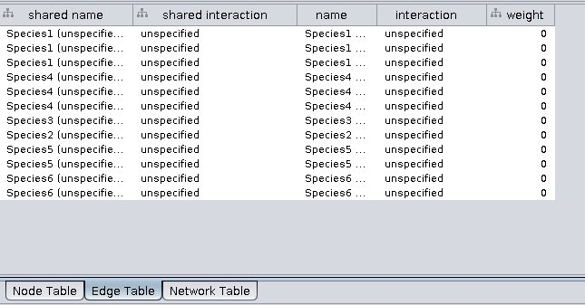

Purpose: I think it is fairly common to make graphs out of data in data frames. It is easy to make a graph from the data frame in igraph, and then easy to convert it to "graphNEL" graph from the Bioconductor "graph" package. However, I cannot figure out how to send the node and edge attributes from these graphs to Cytoscape.

I get the feeling (based on scripts floating around on github, like this one https://gist.github.com/Vessy/6005052) that this used to work in RCytoscape. I am looking at `displayGraph` for ideas of what could be done, but there are any hints or ideas of what could be changed (or how I could send the data differently) I would be happy to attempt an implementation. 


```{r, message=FALSE}
# Load libraries
library(igraph)
library(RCy3)
cy <- CytoscapeConnection ()
deleteAllWindows(cy)
```

# Trying send edge and node attributes to Cytoscape when they are already defined in a graph

```{r}
dataSet <- read.table("species_test.txt",
                      header = TRUE,
                      sep = "\t",
                      row.names = NULL)
```

Made a food web with weights of interactions
```{r}
dataSet 
# Create a graph. Use simplify to ensure that there are no duplicated edges or self loops
gD <- simplify(graph.data.frame(dataSet,
                                directed=FALSE))
vcount(gD)
ecount(gD)
## edge weight is read in
E(gD)$weight
```

```{r}
plot(gD)
# Calculate degree for all nodes
V(gD)$degree <- igraph::degree(gD)

# Check the attributes
gD
```

```{r}
## convert from igraph to graph format
gD.cyt <- igraph.to.graphNEL(gD)

gD.cyt <- initNodeAttribute(gD.cyt,
                            'degree',
                            'integer',
                            0) 
nodeData(gD.cyt)
edgeData(gD.cyt)

gD.cyt <- initEdgeAttribute(gD.cyt,
                            "weight",
                            'integer',
                            0)
slotNames(gD.cyt)
gD.cyt@edgeData ## is class attrData --so in slot data  you have the weights and then there is a slot default
slotNames(gD.cyt@edgeData)

gDCW <- CytoscapeWindow("Testing species",
                        graph=gD.cyt,
                        overwriteWindow = TRUE)
displayGraph(gDCW)
```


No node or edge data sent to Cytoscape:





# Based on the RCy3 tutorial

This way works to send node and edge data to Cytoscape.

```{r}
g <- new ('graphNEL',
          edgemode = 'directed')
g <- graph::addNode('Species1', g)
g <- graph::addNode('Species2', g)
g <- graph::addNode('Species3', g)
```


```{r}
cw <- CytoscapeWindow('co-occurrence',
                      graph = g,
                      overwrite = TRUE)
displayGraph(cw)
layoutNetwork(cw, layout.name = 'grid')
```


```{r}
g <- cw@graph   # created above, in the section  'A minimal example'
g <- graph::addEdge ('Species1',
                     'Species2',
                     g)
g <- graph::addEdge ('Species1',
                     'Species3',
                     g)
g <- graph::addEdge ('Species3',
                     'Species2',
                     g)

cw@graph <- g
displayGraph (cw)

g <- initEdgeAttribute(graph=g,
                       attribute.name='weight',
                       attribute.type='numeric',
                       default.value=0.0)    

edgeData(g, 'Species1', 'Species2', 'weight') <- 1.0
edgeData(g, 'Species1', 'Species3', 'weight') <- 2.0 

cw@graph <- g
displayGraph (cw)
```


