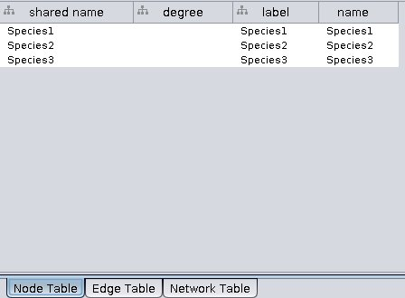

# Testing out sending graph properties from data frame to Cytoscape
Julia Gustavsen  
June 9, 2016  

Purpose: I think it is fairly common to make graphs out of data in data frames. It is easy to make a graph from the data frame in igraph, and then easy to convert it to "graphNEL" graph from the Bioconductor "graph" package. However, I cannot figure out how to send the node and edge attributes from these graphs to Cytoscape.

I get the feeling (based on scripts floating around on github, like this one https://gist.github.com/Vessy/6005052) that this used to work in RCytoscape. I am looking at `displayGraph` for ideas of what could be done, but there are any hints or ideas of what could be changed (or how I could send the data differently) I would be happy to attempt an implementation. 


```r
# Load libraries
library(igraph)
library(RCy3)
cy <- CytoscapeConnection ()
deleteAllWindows(cy)
```

# Trying send edge and node attributes to Cytoscape when they are already defined in a graph


```r
dataSet <- read.table("species_test.txt",
                      header = TRUE,
                      sep = "\t",
                      row.names = NULL)
```

Made a food web with weights of interactions

```r
dataSet 
```

```
##          V1       V2 weight
## 1  Species1 Species2      2
## 2  Species1 Species3      3
## 3  Species4 Species5      5
## 4  Species4 Species1      2
## 5  Species3 Species5      2
## 6  Species2 Species4      1
## 7  Species5 Species6      1
## 8  Species6 Species7      1
## 9  Species6 Species8      2
## 10 Species5 Species7      3
## 11 Species4 Species7      9
## 12 Species6 Species2     21
```

```r
# Create a graph. Use simplify to ensure that there are no duplicated edges or self loops
gD <- simplify(graph.data.frame(dataSet,
                                directed=FALSE))
vcount(gD)
```

```
## [1] 8
```

```r
ecount(gD)
```

```
## [1] 12
```

```r
## edge weight is read in
E(gD)$weight
```

```
##  [1]  2  3  2  1  5  9  2 21  1  3  1  2
```


```r
plot(gD)
```

<!-- -->

```r
# Calculate degree for all nodes
V(gD)$degree <- igraph::degree(gD)

# Check the attributes
gD
```

```
## IGRAPH UNW- 8 12 -- 
## + attr: name (v/c), degree (v/n), weight (e/n)
## + edges (vertex names):
##  [1] Species1--Species4 Species1--Species3 Species1--Species2
##  [4] Species4--Species2 Species4--Species5 Species4--Species7
##  [7] Species3--Species5 Species2--Species6 Species5--Species6
## [10] Species5--Species7 Species6--Species7 Species6--Species8
```


```r
## convert from igraph to graph format
gD.cyt <- igraph.to.graphNEL(gD)

gD.cyt <- initNodeAttribute(gD.cyt,
                            'degree',
                            'integer',
                            0) 
nodeData(gD.cyt)
```

```
## $Species1
## $Species1$degree
## [1] 3
## 
## 
## $Species4
## $Species4$degree
## [1] 4
## 
## 
## $Species3
## $Species3$degree
## [1] 2
## 
## 
## $Species2
## $Species2$degree
## [1] 3
## 
## 
## $Species5
## $Species5$degree
## [1] 4
## 
## 
## $Species6
## $Species6$degree
## [1] 4
## 
## 
## $Species7
## $Species7$degree
## [1] 3
## 
## 
## $Species8
## $Species8$degree
## [1] 1
```

```r
edgeData(gD.cyt)
```

```
## $`Species1|Species4`
## $`Species1|Species4`$weight
## [1] 2
## 
## 
## $`Species1|Species3`
## $`Species1|Species3`$weight
## [1] 3
## 
## 
## $`Species1|Species2`
## $`Species1|Species2`$weight
## [1] 2
## 
## 
## $`Species4|Species1`
## $`Species4|Species1`$weight
## [1] 2
## 
## 
## $`Species4|Species2`
## $`Species4|Species2`$weight
## [1] 1
## 
## 
## $`Species4|Species5`
## $`Species4|Species5`$weight
## [1] 5
## 
## 
## $`Species4|Species7`
## $`Species4|Species7`$weight
## [1] 9
## 
## 
## $`Species3|Species1`
## $`Species3|Species1`$weight
## [1] 3
## 
## 
## $`Species3|Species5`
## $`Species3|Species5`$weight
## [1] 2
## 
## 
## $`Species2|Species1`
## $`Species2|Species1`$weight
## [1] 2
## 
## 
## $`Species2|Species4`
## $`Species2|Species4`$weight
## [1] 1
## 
## 
## $`Species2|Species6`
## $`Species2|Species6`$weight
## [1] 21
## 
## 
## $`Species5|Species4`
## $`Species5|Species4`$weight
## [1] 5
## 
## 
## $`Species5|Species3`
## $`Species5|Species3`$weight
## [1] 2
## 
## 
## $`Species5|Species6`
## $`Species5|Species6`$weight
## [1] 1
## 
## 
## $`Species5|Species7`
## $`Species5|Species7`$weight
## [1] 3
## 
## 
## $`Species6|Species2`
## $`Species6|Species2`$weight
## [1] 21
## 
## 
## $`Species6|Species5`
## $`Species6|Species5`$weight
## [1] 1
## 
## 
## $`Species6|Species7`
## $`Species6|Species7`$weight
## [1] 1
## 
## 
## $`Species6|Species8`
## $`Species6|Species8`$weight
## [1] 2
## 
## 
## $`Species7|Species4`
## $`Species7|Species4`$weight
## [1] 9
## 
## 
## $`Species7|Species5`
## $`Species7|Species5`$weight
## [1] 3
## 
## 
## $`Species7|Species6`
## $`Species7|Species6`$weight
## [1] 1
## 
## 
## $`Species8|Species6`
## $`Species8|Species6`$weight
## [1] 2
```

```r
gD.cyt <- initEdgeAttribute(gD.cyt,
                            "weight",
                            'integer',
                            0)
slotNames(gD.cyt)
```

```
## [1] "nodes"      "edgeL"      "edgeData"   "nodeData"   "renderInfo"
## [6] "graphData"
```

```r
gD.cyt@edgeData ## is class attrData --so in slot data  you have the weights and then there is a slot default
```

```
## An object of class "attrData"
## Slot "data":
## $`Species1|Species4`
## $`Species1|Species4`$weight
## [1] 2
## 
## 
## $`Species1|Species3`
## $`Species1|Species3`$weight
## [1] 3
## 
## 
## $`Species1|Species2`
## $`Species1|Species2`$weight
## [1] 2
## 
## 
## $`Species4|Species1`
## $`Species4|Species1`$weight
## [1] 2
## 
## 
## $`Species4|Species2`
## $`Species4|Species2`$weight
## [1] 1
## 
## 
## $`Species4|Species5`
## $`Species4|Species5`$weight
## [1] 5
## 
## 
## $`Species4|Species7`
## $`Species4|Species7`$weight
## [1] 9
## 
## 
## $`Species3|Species1`
## $`Species3|Species1`$weight
## [1] 3
## 
## 
## $`Species3|Species5`
## $`Species3|Species5`$weight
## [1] 2
## 
## 
## $`Species2|Species1`
## $`Species2|Species1`$weight
## [1] 2
## 
## 
## $`Species2|Species4`
## $`Species2|Species4`$weight
## [1] 1
## 
## 
## $`Species2|Species6`
## $`Species2|Species6`$weight
## [1] 21
## 
## 
## $`Species5|Species4`
## $`Species5|Species4`$weight
## [1] 5
## 
## 
## $`Species5|Species3`
## $`Species5|Species3`$weight
## [1] 2
## 
## 
## $`Species5|Species6`
## $`Species5|Species6`$weight
## [1] 1
## 
## 
## $`Species5|Species7`
## $`Species5|Species7`$weight
## [1] 3
## 
## 
## $`Species6|Species2`
## $`Species6|Species2`$weight
## [1] 21
## 
## 
## $`Species6|Species5`
## $`Species6|Species5`$weight
## [1] 1
## 
## 
## $`Species6|Species7`
## $`Species6|Species7`$weight
## [1] 1
## 
## 
## $`Species6|Species8`
## $`Species6|Species8`$weight
## [1] 2
## 
## 
## $`Species7|Species4`
## $`Species7|Species4`$weight
## [1] 9
## 
## 
## $`Species7|Species5`
## $`Species7|Species5`$weight
## [1] 3
## 
## 
## $`Species7|Species6`
## $`Species7|Species6`$weight
## [1] 1
## 
## 
## $`Species8|Species6`
## $`Species8|Species6`$weight
## [1] 2
## 
## 
## 
## Slot "defaults":
## $weight
## [1] 0
## attr(,"class")
## [1] "INTEGER"
```

```r
slotNames(gD.cyt@edgeData)
```

```
## [1] "data"     "defaults"
```

```r
gDCW <- CytoscapeWindow("Testing species",
                        graph=gD.cyt,
                        overwriteWindow = TRUE)
displayGraph(gDCW)
```

```
## [1] "degree"
## [1] "label"
## [1] "weight"
```


No node or edge data sent to Cytoscape:


# Based on the RCy3 tutorial

This way works to send node and edge data to Cytoscape.


```r
g <- new ('graphNEL',
          edgemode = 'directed')
g <- graph::addNode('Species1', g)
g <- graph::addNode('Species2', g)
g <- graph::addNode('Species3', g)
```


```r
cw <- CytoscapeWindow('co-occurrence',
                      graph = g,
                      overwrite = TRUE)
displayGraph(cw)
```

```
## [1] "label"
```

```r
layoutNetwork(cw, layout.name = 'grid')
```


```r
g <- cw@graph   # created above, in the section  'A minimal example'
g <- graph::addEdge ('Species1',
                     'Species2',
                     g)
g <- graph::addEdge ('Species1',
                     'Species3',
                     g)
g <- graph::addEdge ('Species3',
                     'Species2',
                     g)

cw@graph <- g
displayGraph (cw)
```

```
## [1] "label"
```

```r
g <- initEdgeAttribute(graph=g,
                       attribute.name='weight',
                       attribute.type='numeric',
                       default.value=0.0)    

edgeData(g, 'Species1', 'Species2', 'weight') <- 1.0
edgeData(g, 'Species1', 'Species3', 'weight') <- 2.0 

cw@graph <- g
displayGraph (cw)
```

```
## [1] "label"
## [1] "weight"
```



